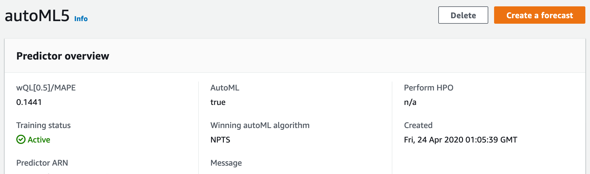

# 평가

예측(forecast)결과에 감탄을 자아내며 무릎을 쳐 대지 않는다면
그 결과에 대해서 생각하게 됩니다. '과연 이 예측은 맞을 것인가?'
이 질문에 대해 '그렇다', '아니다'라고 답변할 수 있는 사람도 기계도
세상에는 존재하지 않습니다.

다만, '그러할 것을 확신할 학률은 얼마 정도입니다'가 적당하리라 봅니다.
그것이 그렇게 될 확률이 아니라, 그것이 그렇게 될 것을 확신할 확률이라고 합니다.
두 문장이 같은 뜻이라고 여겨지신다면 저의 전달력이 좋지 못해서 입니다.
혹은 제가 뭔가를 잘 못 배웠을지도 모르겠습니다. 하지만, 한 가지 분명한 것이 있습니다.
아직 경험 많은 베테랑 보다 나은 예측을 할 수 있는 기계는 없다고 봅니다.
베테랑을 RESPECT!

## 어려운 이야기

우리가 지금부터 볼 것들은 모두 숫자[數字]입니다.

### 예측기(predictor)

예측기 훈련이 끝나면 다음의 화면을 보실 수 있습니다.

위 그림 가운데 컬럼에는 복잡한 숫자들이 보입니다. 숫자들이 출력되고 많은 자리를
찾이하는 것을 봐서는 중요해 보입니다. 그것에 대한 설명으로 공식 개발자 안내서에서는
'[예측기 지표](https://docs.aws.amazon.com/ko_kr/forecast/latest/dg/metrics.html)'에서 설명하고 있습니다.  
이미 아시겠지만, wQL은 wQuantileLoss의 약어입니다. 

위 수식을 해석하는 건 저의 역할이 아니라는 생각을 합니다. 관련된 설명은
'[예측기 지표](https://docs.aws.amazon.com/ko_kr/forecast/latest/dg/metrics.html)'에
있습니다. 저 곳의 설명이 이해하기 쉬운 건 아니지만, 이 보다 잘 설명할 자신 또한 없습니다.
한 번 즈음 정독해 보십시다. 기본적인 용어 설명도 곁들여져 있으니, 꼭 읽어 보시기 바랍니다.

!!! note ""
    이 글을 읽는 누군가가 좋은 설명을 적어 주시길를 간절히 기대하는 마음도 있습니다.
    본 문서의 리포지토리는 언제나 당신을 환영합니다 :-D

## 쉬운 이야기

Amazon Forecast는 목적성이 강한 서비스입니다.
사용자가 깊이 있는 관련 지식을 갖추지 못 해도, 원하는 결과를 얻을 수 있습니다.
autoML은 그 길을 알려줍니다. 의심은 배우는 자의 기본 자세입니다.
하지만, 배우는 자가 충분한 시간과 노력을 기할 수 없다면, 의심을 거두고
autoML이 열어주는 빛의 길에 발 딛는 것을 두려워 하지 마세요.

### autoML

autoML은 여러 예측기의 평가 결과들을 상호 비교하여 최적의 알고리즘을
선택해 줍니다. 앞서
[예측기 훈련](../handson-labs/train-a-predictor/#algorithm-selection)에서
언급한 것처럼, 단 하나의 단점은 소요 시간이 길다는 것 뿐입니다.
(시간은 곧 돈이라는 것도 알고는 있습니다만)

하지만, 만약 여러분께서 보유한 시계열 데이터로 Amazon Forecast를
활용하고 싶을 때 가장 큰 걸림돌이 되는 것이 '어떤 알고리즘이 맞을지 모르겠다'라면
autoML을 선택하는 것이 가장 좋은 선택이 될 것입니다. 아래의 그림을 봅시다.

하나의 데이터-셋을 가지고 Amazon Forecast가 제공하는 모든 알고리즘들을 사용하여 예측기를
생성했습니다. 그 중 autoML도 있습니다. 그리고 개발자 공식 문서에 설명을 떠맡긴 숫자들이
세 개의 행(column)을 이루며 줄을 지어 있습니다. 이들의 숫자들은 낮을수록 예측의 정확도가
높다고 단순히 해석해도 오류는 없습니다. 그리고 autoML은 가장 적합한 알고리즘을 선택합니다.
이 두 조건을 && 로 엮으면, - autoML을 제외하고 - 이 데이터-셋으로 예측기가 가장
잘 훈련된 알고리즘은 'NPTS5'라는 이름을 가진 것입니다.

autoML도 같은 방식으로 알고리즘을 선택합니다. 다음의 그림을 봅시다,
위 그림에서 'autoML5'를 선택하고 들어간 화면입니다. 

여기에서 autoML은 `wQL[0.5]/MAPE`을 기준으로 알고리즘을 선택했고, 그 결과로
`NPTS`를 Winning autoML algorithm으로 선정했다는 것을 알 수 있습니다.

단 한 번 제대로 된 예측을 하고 싶을 때에도, autoML을 선택하는 것이 좋겠습니다.
그리고 앞으로 지속적으로 학습하고 예측을 하고 싶을 때에도 특별한 배경지식이 있고,
그 배경지식으로 확고한 신념이 또한 마음 속에 정직하게 자리하고 있지 않다면 -
자신의 지식을 의심할 정도로 양심적이라면 - 첫회를 autoML로 알고리즘을 선택받고
앞으로 '지속적'으로 훈련하고 예측할 때 그 선택받은 알고리즘을 사용하는 것이
현명할 수 있습니다.

사실, autoML을 검증하기 위해 이 페이지에 나오는 것처럼 모든 알고리즘을 한 번씩
예측기 학습에 동원할 필요는 없습니다. autoML은 아래의 그림처럼 개별 알고리즘의
메트릭을 친절하게 보여 줍니다.

## 예측 정확도 향상

같은 알고리즘으로 예측기를 훈련할 때, 'Number of backtest windows' 값을
늘려 백테스트로 예측기를 조정해 보는 시도도 가능하겠습니다.
물론, 충분한 데이터를 입력했다는 가정이 있다면 말이죠. 하지만,

가장 중요한 건 **대상 시계열 데이터를 충분히 많이 준비하고 훈련에 사용**하는 것입니다.
[데이터-셋 내 최대 행(row)수는 1,000,000,000.입니다](https://docs.aws.amazon.com/ko_kr/forecast/latest/dg/limits.html).
10억 행을 입력할 수 있습니다. 걱정하지 마시고 많이 준비하십시다.

대상 시계열 데이터-셋 이외의 데이터-셋은 정확도 향상에 크게 도움이 되지 않습니다.
항목 메타-데이터는 말할 것도 없습니다. 노력은 많은 데이터를 시계열 데이터에 걸맞게
되도록이면 자르지 말고 하나의 셋으로 만들어 훈련에 사용하는 것입니다.
최근 [Amazon Forecast는 시계열 데이터의 최대 문제, missing value - 즉, 누락 값을
처리하는, 그러니까 그 공백을 채워내는 방법을 고안하여 채택](https://docs.aws.amazon.com/ko_kr/forecast/latest/dg/howitworks-missing-values.html)했습니다.
사용자의 고민 중 가장 큰 하나가 사라지게 되었습니다.
