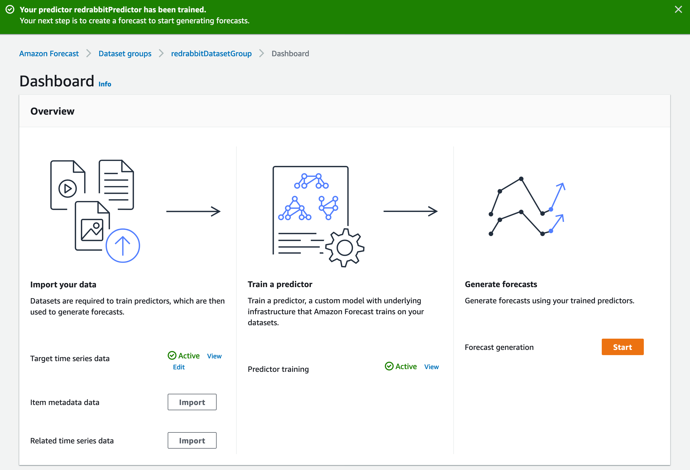

# 예측 생성

전 단계가 잘 끝났다면 아래의 화면을 만나고 있을 것입니다.  
만약 정상적인 완료가 되지 않았다면 아래의 화면과 다를 것이며 다음 단계로 진행할 수 없습니다.
'Predictor training'이 녹색 글자로 'Active'가 되어 있는지 확인합니다.

이제 우측 아랫쪽에 위치한 오랜지색, `Start`{style='background-color:#ef6c00; color:white'}를 눌러 Generate forecasts 예측을 생성합니다.

몇가지 입력을 기다리는 화면입니다. 매단계 마다 했던 '이름'을 짓는 일이 있고,
이미 훈련해 둔 예측기(predictor)를 선택하고,
임의 선택으로 마지막 입력 창에 기입을 하거나 말거나 할 수 있습니다.
자, 그러면 개별 입력값을 살펴 보겠습니다.

## 입력값 설명

예측(forecast)를 생성하기 위해서 간단히 몇가지 값을 정하면 됩니다. 첫번째는 '역시' 이름이고,
두번째는 전 단계에서 완료한 예측기(predictor)를 선택하는 것이며, 마지막으로 세번째는
예측 유형(forecast type)을 선언하는 것입니다.

하나의 데이터-셋 그룹으로 여러 예측기를 생성할 수 있습니다. 서로 다른 알고리즘을 선택하든지,
예측의 범위를 다르게 한다든지 말이죠. 그렇게 생성한 '하나의 데이터-셋 그룹' 내에 존재하는
모든 예측기를 선택할 수 있습니다. 본 실습에서는 하나의 예측기만 훈련했기 때문에 해당되는
예측기(predictor)는 하나입니다.

### Forecast types

입력 직전에 조금 생각해 볼 수 있는 부분입니다. 물론, 아무런 입력을 하지 않아도 Amazon Forecast
는 기본값으로 작성해 줍니다. 만약 기본적으로 선택되는 값 `.10`, `.50`, 그리고 `.90`에
의문이 있다면 여기를 읽어 보시면 됩니다. 아니라면 `Create a forecast`{style='background-color:#ef6c00; color:white'}을
클릭해서 다음 단계로 갑니다.

**Quantile**

Quantile은 AWS 공식 문서에서는 분위(分位)로 번역합니다.
네이버 국어사전에서는 분위를 다음과 같이 설명하고 있습니다.
'소득이나 재산을 일정한 기준에 따라 나눈 등급을 나타내는 단위.'  
사전에서 Quantile을 찾아보면, 변위(變位) 혹은 변위치(變位置)로
번역되는 것을 알 수 있습니다.
아무튼 가슴에 와 닿는 용어가 아닌 것은 확실해 보입니다.
반듯한 이해를 위해서는 역시 위키피디아를 찾아볼 수 밖에 없습니다.
거기에서는 [Quantile](https://en.wikipedia.org/wiki/Quantile)을 이렇게 설명하고 있습니다.

> In statistics and probability quantiles are cut points dividing 
    the range of a probability distribution into continuous intervals 
    with equal probabilities, or dividing the observations in a sample 
    in the same way. There is one fewer quantile than the number of 
    groups created. Thus quartiles are the three cut points that will 
    divide a dataset into four equal-sized groups. Common quantiles have 
    special names: for instance quartile, decile (creating 10 groups: 
    see below for more). The groups created are termed halves, thirds, 
    quarters, etc., though sometimes the terms for the quantile are 
    used for the groups created, rather than for the cut points.

그렇다면, `.10`, `.50`, `.90`은 어떤 의미일까요?
10분위, 50분위, 90분위의 값을 출력해 보겠다는 뜻이 됩니다.
응용해서, `.60`, `.99`도 가능하긴 합니다 -- 정말 필요하다 판단되면 말이죠.
그리고 `mean`은 평균값입니다.

이 부분과 연계된 개념은 '평가'에서 다시 다룰 수 있도록 하겠습니다.
