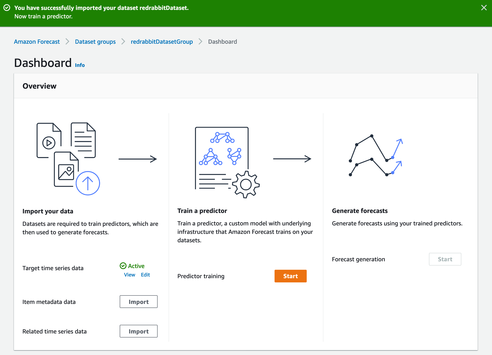

# 대상 시계열 데이터 입수

'Dataset import name'을 설정하고, 'Timestamp format'을 정의한 후, 'IAM role' 설정 그리고
준비 단계에서 업로드해 두었던 학습 데이터의 위치를 지정해 두는 단계입니다.

'Timestamp format'의 항목은 변경하면 안 됩니다.
앞서 설명한 것과 같이 허용하는 형식이 한 가지 뿐이기 때문입니다. 지정된 값을 그대로 사용하면 됩니다.
그럼에도 불구하고 이 항목이 존재하는 이유는 알 수 없지만,
개발 초기에 이 부분을 활용할 계획이었든지, 앞으로 지원한 계획을 가지고 있는 건 아닐까?
하는 추정만 가능하겠습니다.

위 그림에서 보는 것과 같이, IAM role은 'Create a new role', 'Enter a custom IAM role ARN',
그리고 'Use existing role'을 사용할 수 있다. 이미 준비해 둔 IAM role이 있다면 pull down 메뉴
아랫쪽에 나타날 것이며, 앞선 준비 단계에서 작성해 둔 것의 ARM 정보를 그림의 적색 표시 부분에
직접 입력할 수 있습니다.

본 실습에서는 'Create a new role'을 안내하겠습니다.  
Pull down 메뉴에서 'Create a new role'을 선택하여 아래의 화면으로 진행합니다.

무디게 설정하고 싶다면, 'Any S3 bucket'을 선택할 수도 있겠지만 좋은 생각은 아닙니다.
보안은 최소한의 조건을 부여하면서 시작되는 것입니다. 우리는 'Specific S3 buckets'을
선택하고 준비 단계에서 작성해 둔 S3 버킷 이름을 기입합니다.

위 그림에서도 짧게 설명이 붙어 있지만, 쉼표로 구분하여 여러 버킷을 기입할 수도 있습니다.
여러 목적으로 구분되는 서로 다른 버킷으로부터 시계열 데이터를 입력받을 일이 있거나
본 실습을 진행하면서 알게 될, 결과를 출력 export해서 담아낼 버킷을 따로 운영하고
싶을 때 적당할 수 있습니다.

 

본 단계의 마지막으로, 'Data location'에 준비 단계에서 업로드한 데이터의 위치를 정확히
입력합니다. 자신의 훌륭한 기억력과 키보드 타건 동작으로 입력할 수도 있지만,
편리와 정확이 이보다 우선된다면, S3에서 아래의 그림과 같이 '경로 복사'를 클릭하고
위 입력창에 붙혀 넣는 수도 있다.

자, 이제 영롱한 오랜지 색의 `Start import`{style='background-color:#ef6c00; color:white'} 버튼을 클릭합니다.

대상 시계열 데이터가 입수(import)를 시작하면 화면이 전환되어 다음의 그림과 같은 화면을 만나게 됩니다.
별 다른 내용은 아니고, 지정한 데이터를 잘 읽어 들이고 있다는 정도입니다.

## 데이터-셋 입력 진행

이 과정이 끝나면, 화면은 다음과 같은 안내를 상단에 보여줍니다. 잘 되었다는 뜻입니다.
물론, 어떤 문제가 있으면, 붉은 바탕에 적절한 안내문을 볼 수 있습니다.

그리고, 아랫쪽에 'Target time series data' 항목에 'Active'라고 적힌 녹색 안내를 볼 수 있습니다.
또 그 아랫쪽에 두 가지의 데이터를 `import`할 수 있는 버튼이 보입니다.

[데이터-셋 그룹 작성](../dataset-groups/) 단계에서 설명하였습니다.
그 세 가지 중에 가장 중요한 것이 이전 단계가지 S3에 업로드하고 데이터-셋 그룹에 입수(import)한
'대상 시계열 데이터'이고, 나머지 두 가지에 해당 됩니다.

### 나머지 데이터-셋

데이터-셋은 다음의 세 가지를 현재 다루고 있습니다.

* 대상 시계열 데이터-셋 (Target time series dataset) - 필수 (required)
* 관련 시계열 데이터-셋 (Related time series dataset) - 임의 (optional)
* 항목 메타-데이터 데이터-셋 (Item metadata dataset) - 임의 (optional)

이 중 Amazon Forecast에서 데이터-셋 그룹을 작성하는데 반드시 필요한 것은 '대상 시계열 데이터-셋' 뿐입니다.
나머지는 도움이 되지만, 결정적인 요소는 아닙니다. 알고리즘에 따라서 사용할 수 없는 데이터-셋도 있습니다.
예를 들어, DeepAR+와 Prophet은 관련 시계열 데이터-셋을 활용할 수 있지만, 나머지 알고리즘은
이 데이터-셋을 다루지 않습니다.
이에 대한 자세한 설명은 공식 개발자 안내서에 아주 잘 설명하고 있습니다.

다음을 참조하세요:

* [관련 시계열](https://docs.aws.amazon.com/ko_kr/forecast/latest/dg/related-time-series-datasets.html)
* [항목 메타데이터](https://docs.aws.amazon.com/ko_kr/forecast/latest/dg/item-metadata-datasets.html)
* [데이터 세트 지침](https://docs.aws.amazon.com/ko_kr/forecast/latest/dg/dataset-import-guidelines-troubleshooting.html)
* [누락 값 처리](https://docs.aws.amazon.com/ko_kr/forecast/latest/dg/howitworks-missing-values.html)
