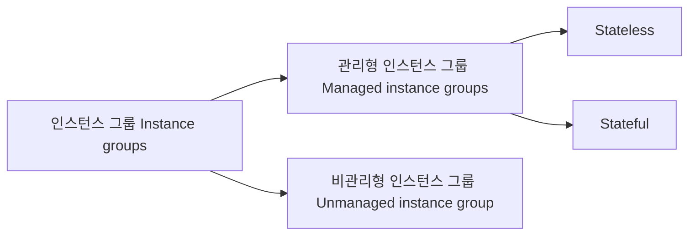

# 인스턴스 그룹

인스턴스 그룹(Instance groups)는 
관리형 인스턴스 그룹(Managed instance groups)과 
비관리형 인스턴스 그룹(Unmanaged instance groups)로 나뉩니다. 그리고 관리형 인스턴스 그룹은 Stateless를 위한 구성과 Stateful을 위한 구성으로 나누어 볼 수 있습니다.

## 고가용 시스템에 대한 옛날 이야기

고가용성 컴퓨팅 시스템을 만들 때 크게 두가지의 방법을 우리는 그 동안 선택해 왔습니다. 

### Fault tolerant system

첫번째는 절대 죽지 않을 것만 같은 하드웨어 설계를 반영하여 SPOF(single point of failure)를 구조적으로 
제거하고 공급 전력이 끊기지만 (이 또한 이중화 이상) 않는다면 단순한 하드웨어 실패(이 또한 잘 일어나지 않게)로
컴퓨터 자체가 멈추지 않도록 설계하는 것입니다. 동일한 성능과 용량에 비하여 월등히 고가인 이러한 시스템을
Fault tolerant system[폴트 톨러런트 시스템]이라고 부릅니다.

우리 말로는, 항-장애-시스템, 항-결함-시스템, 혹은 결함-감내-시스템 등으로 
번역/통용되었지만 정확한 원래의 느낌을 전달하기엔
부족한 건 어쩔 수 없습니다.

이러한 fault tolerant system은 Cray, Sun Microsystems 등 
과거 여러 서버 시스템 제작사에서 출시를 했으며, 
mission-critical 업무에 적용되고는 했습니다. 국방 통신 등 생각보다 광범위한 고객이 있었습니다.
지금은 거의 잊혀진 시스템이 되었습니다. 제가 경험한 마지막 fault tolerant system은 
Sun Microsystems의 [FT1800](https://docs.oracle.com/cd/E19102-01/n1800.srvr/index.html)입니다. 
인상적이었고 까다롭고 재미있는 시스템이었습니다.

Fault tolerant system은 단순히 하드웨어만 설계를 해 낸다고 해서 동작하는 것이 아닙니다.
하드웨어의 변화를 감지하고 그에 대응하여 프로세스들과 디바이스 등을 정리하고 재설정하는 것은
운영체제 그리고 그 핵심인 커널의 몫이기 때문입니다. 운영체제에서 그것을 할 수 있어야 
하드웨어의 변화/변경에도 서비스를 유지할 수 있습니다.
그래서, fault tolerant system은 만들기도 어렵고, 유지하기도 쉽지 않고, 가격도 상당하며 
새로운 기술과 IT 시스템에 대한 관념이 변화하면서 서서히 잊혀지기 시작하여 지금은
오래된 유산처럼 남아 있습니다.

### HA system

HA, High-availability system은 상위 제목과 같은 고가용 시스템으로 번역하는 게 
맞는 것 같은데, 우리나라 업계에서는 '서버 이중화' 등으로 자주 언급되었습니다.
HA 시스템은 active-standby로 구성에 참여하는 단일 시스템에 대한 역할을 구분하고 정의하고 
설계에 반영합니다. 

## 관리형 인스턴스 그룹

관리형 인스턴스 그룹은, 영문표기(Managed Instance Groups)의 두문자를 따서, MIG라고도 부릅니다.
여기에서도 앞으로 MIG라고 부르겠습니다.

## 비관리형 인스턴스 그룹

이름에서부터 알 수 있듯이, MIG의 비관리형 유형입니다. 
MIG에서 기대할 수 있는 여러 고유 기능을 제거하는 대신
특목적적인 워크로드를 수용할 수 있게 설계되어 있습니다.