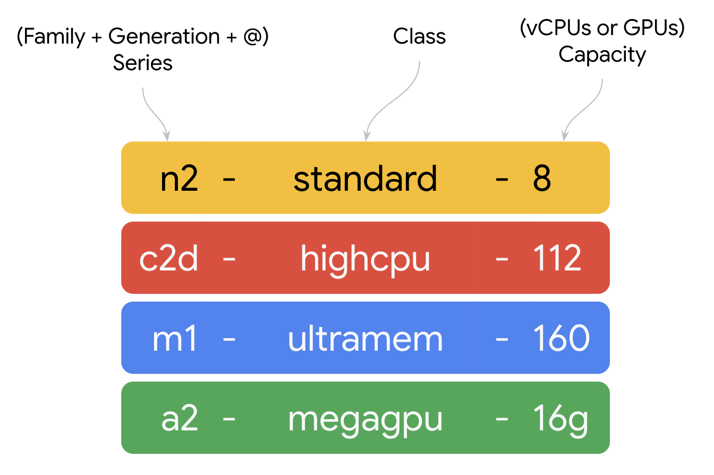
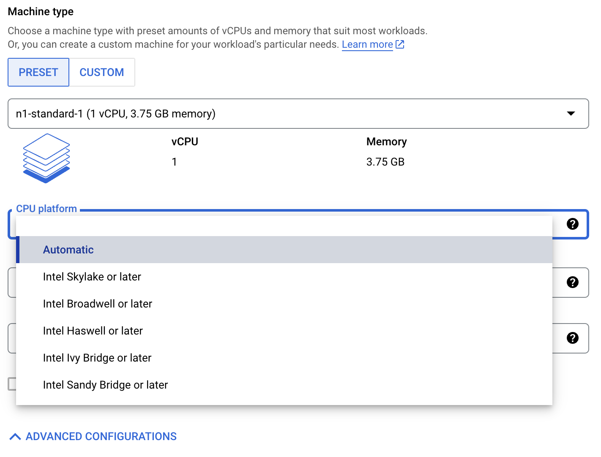

# 가상 머신

Google Cloud의 가상 머신을 위한 서비스는 다른 클라우드 사업자들과 다르지 않습니다.
다만 특별한 것을 찾는다면, 간결하고 직관적인 이름에서 찾을 수 있겠다. 언제나 그렇듯, Google에서 만든
다른 어떤 서비스와 마찬가지로 모두가 쉽게 접근하고 원하는 결과를 얻기에 용이하게 설계되어 있습니다.

Google Cloud의 Compute Engine에서 제공하는 가상 머신의 서비스 구성은
다음의 공식 웹 문서에 잘 정리되어 있습니다.

https://cloud.google.com/products/compute

## 이름 규칙

n2-standard-8 이와 같이 두개의 하이픈을 두고 Google Cloud의 VM 인스턴스들은 이름을 가지게 된다.
여기에는 쉽게 이해할 수 있는 규칙이 있는데, 사용자의 편의를 위해서 라고 해석할 수 있겠다.

위 그림과 같이 일정한 규칙으로 Google Cloud, Compute Engine의 VM 인스턴스들은 이름을 가지고 있습니다.
이해하기 쉽습니다. 두 개의 하이픈으로 3개의 컬럼을 가지고 있는데, 첫번째는 유형과 세대를 표기하고, 두번째는 클래스, 세번째는 vCPU 혹은 GPU 수를 표기합니다. 서번째 컬럼이 GPU 수를 의미할 때에는 접미어 'g'가 붙습니다.

c2d, c4a 와 같이 첫번째 컬럼에 등장하는 VM 계열과 세댸 뒤에 붙는 알파벳, d는 AMD CPU를 a는 arm CPU를 의미합니다.

## CPU 종류 등에 따른 분류

https://cloud.google.com/compute/docs/cpu-platforms  
위 URL을 방문하면, 각 VM 유형마다 어떤 CPU를 플랫폼의 일부로서 채용하고 있는지 알 수 있습니다.

특징적인 것은, 하나의 VM 유형이라 하더라도 다양한 CPU를 기반한다는 점입니다.
대표적인 예는 아래와 같습니다.

- E2: Rome, Milan(이상 AMD EPYC), Broadwell E5, Skylake(이상 Intel Xeon).
- N1: Sandy Bridge, Ivy Bridge, Haswell, Broadwell E5, Skylake.
- N2: Cascade Lake, Ice Lake.

N1와 N2는 VM을 새로 만들 때, CPU 유형을 선택할 수 있습니다. (아래 그림 참고)
기본값은 'Automatic'으로 시스템이 유효한 CPU가 있는 
하드웨어 플랫폼을 선택하게 됩니다. 

## 목적에 따른 분류

각 VM에 대한 분류과 적합한 목적에 대해서는 다음의 공식 웹사이트에서 잘 설명되고 있습니다.  

[머신 계열 리소스 및 비교 가이드](https://cloud.google.com/compute/docs/machine-resource)

아래에는 위 정교한 설명에 대한 보충 설명을 달아 봅니다.

### 범용 General-purpose

특정한 목적에 맞게 설계된 상품이 아니라는 뜻입니다.
이런 저런 다양항 목적에 잘 맞아 떨어집니다.

다만, 법용 VM 중에, N1, N2, N4 등 N 계열과 E2에서는 [커스텀 머신 유형(custom VM type)](https://cloud.google.com/compute/docs/instances/creating-instance-with-custom-machine-type)을 만들 수 있습니다.
이는 Google Cloud의 Compute Engine의 가장 특별한 방식이며, 세상 어디에도 없는 것입니다.

커스텀 머신 유형은, 간단히 말해 vCPU와 Memory의 수량/크기를 사용자가 마음대로 정할 수 있다는 것입니다.
2 vCPU에 128 GB 메모리 구성이 가능하다는 이야기입니다. 또한, VM 계열에서 허용되는 최대 메모리를 벗어나는 메모리를 장착할 수 있도 있는데, 이 때 사용하는 메모리를 [확장 메모리(extended memory)라고 부릅니다](https://cloud.google.com/compute/docs/instances/creating-instance-with-custom-machine-type#extendedmemory). 
매우 적은 vCPU와 아주 큰 메모리를 가지는 VM을 만들 수 있습니다.
서비스 목적에 맞게 VM을 구성해서 사용할 수 있다는 것은 비용 절감 적절한 성능 등 여러 측면에서 매우 큰 이익을 사용자에게 제공할 수 있습니다.

커스텀 머신 유형이라는 특별한 옵션이 제공되는 법용 VM은, 이름에서 느껴지는 무난함을
특별한 '범용' 즉, 어느 워크로드나 잘 어울리는 VM 계열로 판단할 수 있는 중요한 기능입니다.
매우 특별한 워크로드(in-memory 저장 및 분석 혹은 GPGPU를 통한 특별한 연산 등)이 아니라면
범용 VM 유형은 언제나 옳은 답을 제시합니다.

**커스텀 머신 유형은 법용 이외의 VM 유형에서는 제공되지 않습니다.**

### 연산 Compute-optimized

공식 홈페이지에서는 '컴퓨팅 최적화'라고 되어 있습니다. 
'연산 최적화'로 번역하는 것이 더 나은 방향이 아니었나 싶습니다.

vCPU:Memory 비율이 vCPU 쪽으로 기운 VM 유형을 뜻 합니다.
같은 vCPU를 장착한 다른 VM 유형보다 연산 속도가 빠르다는 의미는 아닙니다.
단, C2 같은 경우는 실제로 vCPU 당 속도가 매우 빨라서
이건 예외로 둘 수 있습니다. 그리고 C4의 경우도 

### 메모리 Memory-optimized

vCPU:Memory 비율이 메모리 쪽으로 기운 VM 유형을 뜻 합니다.  
https://cloud.google.com/compute/docs/memory-optimized-machines

### 가속기 Accelerator-optimized

GPU를 기본으로 탑재한 VM 유형을 뜻 합니다.
Google Compute Engine에서는 Nvidia GPU만 지원되고 있습니다.

약간 흥미로운 부분은, N1이라는 범용 VM 유형에 있습니다. 
N1은 A100이 세상이 나오기 전까지 GCE가 제공하는 모든 GPU를 담당했습니다.
T4, V100, P100, P4가 여기에 해당됩다.
서울 리전(asia-northeast3)에서는 앞서 언급된 4개의 오래된 GPU 중 T4만 제공되고 있습니다.

가속기 최적화 VM 유형에 대해서는 [여기, 'GPU 가상머신'](./gpu-vm.md)에서 더 깊이 있게 다루겠습니다.

### 저장소 Storage-optimized

보통의 경우보다 더 큰 크기의 저장소/스토리지를 장착할 수 있다는 의미의 VM 유형입니다.
저장소 즉, VM에 장착되는 스토리지가 절대적으로 성능이 뛰어나거나 하는 일은 
발생하지 않는 기대입니다.  
https://cloud.google.com/compute/docs/storage-optimized-machines
