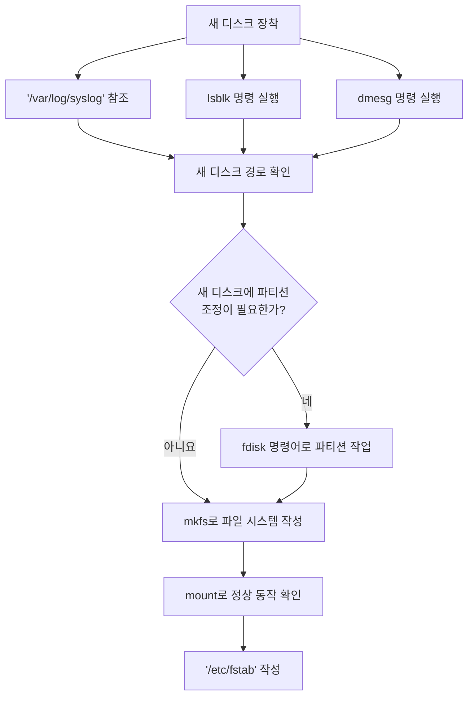

# 새 디스크 추가하기

새로운 디스크를 추가하기 - 라고 적었지만, 사실 여기에서는 다음의 과정을 다룹니다.

1. 새로운 디스크 찾아내기
1. 찾은 디스크 초기화 및 파티션 나누기
1. 파일 시스템 작성하기
1. 마운트하기

그리고 아래의 설명은 정확히 위의 순서에 따른 설명이 되겠습니다.

## 새로운 디스크 장착

시스템를 끄고 (plug-and-play를 지원하는 환경이면 시스템의 off/on 과정이 필요하지 않습니다)
디스크를 장착합니다. 빈자리에 적당히 넣으면 요즈음은 잘 작동합니다. 참 쉬운 세상이 되었습니다.
클라우드에 대포한 VM에 디스크를 추가하는 건 더욱 쉬운 일이 되겠죠?

## 새 디스크 찾기

장착된 새로운 디스크를 찾는 방법은 여러가지가 있습니다. 그러니 누군가가 '이렇게 해야만 해'라고 주장한다면,
그 사람과 멀리하시는 것이 좋습니다. 세상 모든 일이 그렇겠지만, 특히나 오픈소스 세상에서는
'반드시', '꼭', '절대적으로' 라는 것은 대부분, 성립되지 않습니다.

### `/var/log/syslog`를 관찰하기

```bash
Jul 24 22:31:40 bastion kernel: [2862970.027539] usb 1-1.3: new high-speed USB device number 5 using dwc_otg
Jul 24 22:31:41 bastion kernel: [2862970.158911] usb 1-1.3: New USB device found, idVendor=090c, idProduct=1000, bcdDevice=11.00
Jul 24 22:31:41 bastion kernel: [2862970.158938] usb 1-1.3: New USB device strings: Mfr=1, Product=2, SerialNumber=3
Jul 24 22:31:41 bastion kernel: [2862970.158955] usb 1-1.3: Product: Flash Drive FIT
Jul 24 22:31:41 bastion kernel: [2862970.158970] usb 1-1.3: Manufacturer: Samsung
Jul 24 22:31:41 bastion kernel: [2862970.158986] usb 1-1.3: SerialNumber: 0373221010008377
Jul 24 22:31:41 bastion kernel: [2862970.162706] usb-storage 1-1.3:1.0: USB Mass Storage device detected
Jul 24 22:31:41 bastion kernel: [2862970.167001] usb-storage 1-1.3:1.0: Quirks match for vid 090c pid 1000: 400
Jul 24 22:31:41 bastion kernel: [2862970.168031] scsi host0: usb-storage 1-1.3:1.0
Jul 24 22:31:41 bastion mtp-probe: checking bus 1, device 5: "/sys/devices/platform/soc/3f980000.usb/usb1/1-1/1-1.3"
Jul 24 22:31:41 bastion mtp-probe: bus: 1, device: 5 was not an MTP device
Jul 24 22:31:41 bastion mtp-probe: checking bus 1, device 5: "/sys/devices/platform/soc/3f980000.usb/usb1/1-1/1-1.3"
Jul 24 22:31:41 bastion mtp-probe: bus: 1, device: 5 was not an MTP device
Jul 24 22:31:45 bastion kernel: [2862974.397768] scsi 0:0:0:0: Direct-Access     Samsung  Flash Drive FIT  1100 PQ: 0 ANSI: 6
Jul 24 22:31:45 bastion kernel: [2862974.400294] sd 0:0:0:0: Attached scsi generic sg0 type 0
Jul 24 22:31:45 bastion kernel: [2862974.404295] sd 0:0:0:0: [sda] 501253132 512-byte logical blocks: (257 GB/239 GiB)
Jul 24 22:31:45 bastion kernel: [2862974.404727] sd 0:0:0:0: [sda] Write Protect is off
Jul 24 22:31:45 bastion kernel: [2862974.404765] sd 0:0:0:0: [sda] Mode Sense: 43 00 00 00
Jul 24 22:31:45 bastion kernel: [2862974.405074] sd 0:0:0:0: [sda] Write cache: enabled, read cache: enabled, doesn't support DPO or FUA
Jul 24 22:31:45 bastion kernel: [2862974.450013]  sda: sda1
Jul 24 22:31:45 bastion kernel: [2862974.452257] sd 0:0:0:0: [sda] Attached SCSI removable disk
Jul 24 22:31:45 bastion kernel: [2862974.787033] exfat: Deprecated parameter 'namecase'
Jul 24 22:31:46 bastion systemd[1]: Started Clean the /media/pi/256 mount point.
Jul 24 22:31:46 bastion udisksd[398]: Mounted /dev/sda1 at /media/pi/256 on behalf of uid 1000
```

위 예시는 리눅스 장비의 USB 포트에 USB 메모리 장치를 삽입한 후 시스템에서 출되는 메시지입니다.
위 메시지는 우리가 필요한 거의 모든 정보를 제공하고 있는데, 이는 `/var/log/syslog`에 기록되고
어딘가로 지정된 콘솔에도 출력되게 됩니다.

우리가 필요한 정보는 새로운 디스크(저장 매체)의 위치 정보입니다.  
위 메시지에서 우리가 주목해야 할 부분은 `/dev/...`로 시작되는 곳입니다.
`/dev`는 디바이스에 대한 정보가 있는 디렉토리이고, 여기에 디스크의 정보도 수록됩니다.
위 예시에서는 `/dev/sda1`이라는 새로운 디스크의 파티션이 `/media/pi/256`로 마운트된 것까지 알 수 있습니다.

`/var/log/syslog` 를 `tail -f /var/log/syslog`로 실시간으로 관찰하거나 
`more`, `cat`으로 들여다 보는 것 모두 좋은 방식입니다.
하지만, 어떤 사람들은 [`dmesg`](https://en.wikipedia.org/wiki/Dmesg)라는 명령으로 시스템 혹은 운영체제의 변화를 찾기도 합니다.

```bash
$ sudo dmesg
```

`dmesg`는 'print or control the kernel ring buffer'라고 man page에서 말하고 있습니다.
여러 목적이 있지만, 대부분의 운영자들은 커널의 메시지를 확인하기 위해 사용는 것이 일반적입니다.
스토리지 디스크의 감지와 하드웨어 주소를 부여하는 것은 커널의 몫이기 때문에 `dmesg`에 아주 확실한
정보를 획득할 수 있습니다.

!!! note "알려두기"
    위 syslog에 반영된 정보와 아래의 출력된 정보는 같은 시스템에서 가져온 것이라 대략적으로 같은 내용일 수 있지만
    이 문서의 작성 시점에 수 개월의 공백에 있는 탓에 같은 하드웨어 구성인지 확신은 없습니다. 따라서 위의
    syslog 출력문을 아래의 예제와 1:1로 견주어 생각하시지는 않기를 바랍니다.

장착한 새로운 디스크에 대한 정보를 얻는 방식으로 가장 흔하게 사용되는 것은, 다음의 명령을 수행하는 것입니다.

### lsblk 명령어 수행

`sudo lsblk` 이 명령을 수행하면, 다음과 같은 결과가 화면에 출력됩니다.

```bash
$ sudo lsblk
NAME        MAJ:MIN RM  SIZE RO TYPE MOUNTPOINT
sda           8:0    1  239G  0 disk 
`-sda1        8:1    1  239G  0 part /media/pi/256
mmcblk0     179:0    0 29.8G  0 disk 
|-mmcblk0p1 179:1    0  256M  0 part /boot
`-mmcblk0p2 179:2    0 29.6G  0 part /
$ 
```

`lsblk`는 'list block devices'라는 의미로 해당 시스템에 논리적이든 물리적이든 연결된 block device(s)를
화면에 출력해 주는 역할을 합니다. block device 블록 디바이스란, filesystem 파일 시스템을 작성해서 데이터를 직접 작성하거나 기록에 활용하는 저장 장치를 말합니다. 우리가 익히 알고 있는, HDD, SDD 같은 것이 여기에 해당됩니다.

!!! info inline "마운트란?"
    마운트는 mount라는 명령 혹은 그 명령으로 꾀하는 행위를 말합니다. 영단어 mount가 지니고 있는
    의미가 가미되긴 했으리라 보지만, 아무튼, '마운트'는 저장 매체를 시스템에 인식시키고 
    파일 시스템을 작성했거나 이와 유사한 형태로 (프로그램을 포함하는)
    사용자가 '마운트 된 저장매체에' 파일을 생성하고 
    조작할 수 있는 상태라고 할 수 있습니다.

`lsblk`로 현재 시스템에 연결된 디스크/저장장치를 살펴볼 수 있고, 이 때 획득한 정보 - 디스크의 주소 - 를 통해서
다음의 과정으로 나아갈 수 있습니다. 위 출력 내용을 보면, `sda`라는 새로운 디바이스가 있고, `sda1`이라는
파일 시스템이 `/media/pi/256`에 마운트 되어 있다는 걸 알 수 있습니다.

현대의 사용자가 직접 (쉽게) 설치할 수 있는 리눅스 배포한들은 대체로 이동식 저장장치가 시스템에 연결되면
자동 마운트를 해 줍니다. 위 예시에서 보이는 `/media/pi/256`로 그와 같은 경위로 우리가 조회할 수 있습니다.

자동 마운트된 USB 메모리는 다음과 같은 정보를 가지고 있다는 것을 알 수 있습니다.

```bash
$ mount |grep pi\/256
/dev/sda1 on /media/pi/256 type exfat (rw,nosuid,nodev,relatime,uid=1000,gid=1000,fmask=0022,dmask=0022,iocharset=utf8,errors=remount-ro,uhelper=udisks2)
$ 
```

mount라는 명령은 후속 옵셥이 없으면, 시스템에 현재 마운트된 저장장치의 정보를 보여줍니다.
위 출력값의 5번째 행을 보면, `exfat`이라고 나타나는데, 이는 Extended FAT입니다.
이 파일 시스템이 좋다면 이대로 사용해도 되겠습니다. 그런데, 다른 파일 시스템으로 작성하고자 한다면
이 또한 가능합니다.

!!! note "항상 그렇지 않다"
    위에서 보여준 예제는 Raspberry Pi OS가 동작하는 곳에 USB 메모리를 연결한 결과입니다.
    해당 환경에서는 OS가 인식할 수 있는 파일 시스템을 가지고 있는 스토리지 디바이스를 감지하면
    자동으로 마운트하게 됩니다. 모든 Linux를 커널로 가지고 있는 배포판이 동일하게 동작하지는 않습니다.

## 파일 시스템 작성

새로운 디스크의 하드웨어 주소, 혹은, 디바이스 경로를 확인했다면
사용자는 파티션을 나누고 나뉜 파티션에 파일 시스템을 작성하게 됩니다.
이 작업을 하기 전에 해당 디바이스는 반드시 마운트 상태가 아니어야 합니다.
만약 위 예제와 같이 새로운 디바이스가 자동 마운트 되었다면 반드시 마운트를 해제해야 합니다.

```bash
$ sudo umount /media/pi/256
```

만약 파일 시스템을 작성하기 전에 대상 디스크의 파티션을 나누어야 한다면,
`fdisk` 명령으로 해당 작업을 진행할 수 있습니다.

### 파티션 작성

`fdisk`는 전통적인 디스크 관리 명령입니다.
파티션을 삭제 및 작성할 수 있으며, 아주 오래된 프로그램답게 
이제는 거의 잊혀진 (쓸모 없어진) 옵션들도 즐비합니다.

`fdisk` 대신 `parted`라는 명령어를 사용할 수도 있습니다.
같은 목적을 가진 다른 명령어입니다. 여기에서는 `fdisk`를 설명합니다.
현대적인 운영 환경에서는 `parted`가 더 적합할 수 있습니다.

!!! info "parted 사용자 안내서"
    https://www.gnu.org/software/parted/manual/parted.html 

다음의 명령어와 같이 `fdisk`를 확인된 새 디스크 경로를 지정하여 실행합니다.

```bash
$ sudo fdisk /dev/sda

Welcome to fdisk (util-linux 2.37.2).
Changes will remain in memory only, until you decide to write them.
Be careful before using the write command.


Command (m for help):
```
`m`은 도움말을 보는 것인데, 매우 유용합니다.  
모든 걸 기억하는 것보다 어디에 무엇이 있는지 잘 찾는 능력이 더 중요합니다.

!!! note "리눅스 배포판에서 디스크 경로"
    `/dev/sda`는 위 예시에서 나타는 디스크의 경로입니다.<br />
    s는 SCSI, d는 Disk, a는 디스크 순번입니다.
    `/dev/sda는` 해당 시스템에 장착된 첫 번째 SCSI Disk라는 뜻이 됩니다. 
    두 번째 디스크는 `/dev/sdb`가 됩니다.
    (과거의 IDE 형식의 디스크 이외에는 대체로 SCSI 디스크로 구분합니다)
    이 이후에 붙는 숫자는 파티션입니다. `/dev/sda1`은 첫 번째 SCSI Disk의 첫번째 파티션이라는
    의미가 됩니다. 파티션을 작성하는 작업은 그래서, `/dev/sda`를 `fdisk`에서 선택하게 됩니다.

앞서 자동 마운트 된 것에서 알 수 있듯이 해당 `/dev/sda`는 exfat 파티션 1개를 가지고 있습니다.
이 파티션을 지우고, 두 개의 파티션을 만들어 보겠습니다.
먼저 해당 디스크가 어떤 파티션 정보를 가지고 있는지 확인합니다.

```bash
Command (m for help): p
Disk /dev/sda: 239.02 GiB, 256641603584 bytes, 501253132 sectors
Disk model: Flash Drive FIT 
Units: sectors of 1 * 512 = 512 bytes
Sector size (logical/physical): 512 bytes / 512 bytes
I/O size (minimum/optimal): 512 bytes / 512 bytes
Disklabel type: dos
Disk identifier: 0x1fe23221

Device     Boot Start       End   Sectors  Size Id Type
/dev/sda1        2048 501252095 501250048  239G  7 HPFS/NTFS/exFAT

Command (m for help): 
```

우리의 기억과 다름없이 `/dev/sda1` 파티션 하나가 있습니다.  
이 파티션을 지우겠습니다.

```bash
Command (m for help): d
Selected partition 1
Partition 1 has been deleted.

Command (m for help): p
Disk /dev/sda: 239.02 GiB, 256641603584 bytes, 501253132 sectors
Disk model: External USB 3.0 
Units: sectors of 1 * 512 = 512 bytes
Sector size (logical/physical): 512 bytes / 512 bytes
I/O size (minimum/optimal): 512 bytes / 512 bytes
Disklabel type: dos
Disk identifier: 0x1fe23221

Command (m for help): 
```

`d` 입력으로 파티션이 단 하나이기 때문에 재질문 없이 바로 파티션을 지우게 됩니다.
`p`를 입력하여 작업 결과를 확인했습니다. 의도한 것과 같이 조회되는 파티션이 없습니다.

```bash
Command (m for help): F
Unpartitioned space /dev/sda: 239.02 GiB, 256640555008 bytes, 501251084 sectors
Units: sectors of 1 * 512 = 512 bytes
Sector size (logical/physical): 512 bytes / 512 bytes

Start       End   Sectors  Size
 2048 501253131 501251084  239G
```

`F`를 입력하여 전체 여유 공간을 확인했습니다.

```bash
Command (m for help): n
Partition type
   p   primary (0 primary, 0 extended, 4 free)
   e   extended (container for logical partitions)
Select (default p): p
Partition number (1-4, default 1): 1
First sector (2048-501253131, default 2048): 
Last sector, +/-sectors or +/-size{K,M,G,T,P} (2048-501253131, default 501253131): +100G

Created a new partition 1 of type 'Linux' and of size 100 GiB.
Partition #1 contains a ntfs signature.

Do you want to remove the signature? [Y]es/[N]o: Y

The signature will be removed by a write command.
```

`n`을 입력하여 새로운 파티션 작성을 선언했고,  
`p`를 통해 primary 파티션 유형을 선택했습니다,  
`+100G`를 입력하여 새로운 파티션의 크기를 100GB로 선언했습니다.  
이전 파티션에 남아 있는 기록을 지우겠느냐? 라는 질의가 있었고, Yes라고 답했습니다.

아래는 새로 작성한 파티션을 확인하는 `p`의 입력과 결과입니다.

```bash
Command (m for help): p
Disk /dev/sda: 239.02 GiB, 256641603584 bytes, 501253132 sectors
Disk model: External USB 3.0 
Units: sectors of 1 * 512 = 512 bytes
Sector size (logical/physical): 512 bytes / 512 bytes
I/O size (minimum/optimal): 512 bytes / 512 bytes
Disklabel type: dos
Disk identifier: 0x1fe23221

Device     Boot Start       End   Sectors  Size Id Type
/dev/sda1        2048 209717247 209715200  100G 83 Linux

Filesystem/RAID signature on partition 1 will be wiped.

Command (m for help): 
```

나머지 공간에 파티션을 하나 더 만들어 봅니다.

```
Command (m for help): n
Partition type
   p   primary (1 primary, 0 extended, 3 free)
   e   extended (container for logical partitions)
Select (default p): p
Partition number (2-4, default 2): 
First sector (209717248-976773167, default 209717248): 
Last sector, +/-sectors or +/-size{K,M,G,T,P} (209717248-976773167, default 976773167): 

Created a new partition 2 of type 'Linux' and of size 365.8 GiB.

Command (m for help): p
Disk /dev/sda: 465.76 GiB, 500107862016 bytes, 976773168 sectors
Disk model: External USB 3.0
Units: sectors of 1 * 512 = 512 bytes
Sector size (logical/physical): 512 bytes / 512 bytes
I/O size (minimum/optimal): 512 bytes / 512 bytes
Disklabel type: dos
Disk identifier: 0xcb9878ae

Device     Boot     Start       End   Sectors   Size Id Type
/dev/sda1            2048 209717247 209715200   100G 83 Linux
/dev/sda2       209717248 976773167 767055920 365.8G 83 Linux

Command (m for help): w
The partition table has been altered.
Calling ioctl() to re-read partition table.
Syncing disks.

$ 
```

일반적인 PC 기반의 컴퓨터에 연결되는 단일 디스크에서 DOS 형식의 파티션을 만들면
Primary와 Extended를 선택하게 됩니다. Primary 파티션은 단일 디스크 디바이스 당 
4개를 생성할 수 있습니다. 무엇을 선택하든, 추가 디스크로서는 큰 차이가 없습니다.

대부분의 입력값을 시스템에서 주는 값(디폴트 값)으로 선택하면 남아 있는 모든 공간을
새로 만드는 파티션에 할당할 수 있게 됩니다.

`p`를 입력하여 작성한 파티션을 확인하고, `w`를 입력해서 디스크의 파티션 테이블을 저장합니다.

## 파일 시스템 작성

`mkfs` 명령을 사용해서 일반적으로 파일 시스템을 작성합니다.

```bash
$ sudo mkfs -t ext4 /dev/sda1
mke2fs 1.46.5 (30-Dec-2021)
Creating filesystem with 26214400 4k blocks and 6553600 inodes
Filesystem UUID: 3a790adb-946e-41c8-b160-68bc9bb64ac8
Superblock backups stored on blocks: 
	32768, 98304, 163840, 229376, 294912, 819200, 884736, 1605632, 2654208, 
	4096000, 7962624, 11239424, 20480000, 23887872

Allocating group tables: done                            
Writing inode tables: done                            
Creating journal (131072 blocks): done
Writing superblocks and filesystem accounting information: done

$
```

`mkfs` 명령에서 `-t ext4`는 `ext4`라는 유형의 파일 시스템을 선택한다는 옵션입니다.
`ext4`는 'the fourth extended file system'라고 `$ man fs`라면 설명이 있습니다.
아무런 선언이 없으면, `ext2`가 선택됩니다. 

이어오는 선언은, `/dev/sda1`으로 직전 작성한 파티션 정보까지 포함하는 디바이스 경로를
입력한 것입니다. 파일 시스템은 파티션 단위로 작성됩니다. 같은 방식으로 두 번째 파티션도
아래와 같이 작성합니다.

```bash
$ sudo mkfs -t ext4 /dev/sda2
mke2fs 1.46.5 (30-Dec-2021)
Found a dos partition table in /dev/sda2
Proceed anyway? (y,N) y
Creating filesystem with 95881990 4k blocks and 23977984 inodes
Filesystem UUID: c047e4fd-abd8-453c-aeb7-af484330e425
Superblock backups stored on blocks: 
	32768, 98304, 163840, 229376, 294912, 819200, 884736, 1605632, 2654208, 
	4096000, 7962624, 11239424, 20480000, 23887872, 71663616, 78675968

Allocating group tables: done                            
Writing inode tables: done                            
Creating journal (262144 blocks): done
Writing superblocks and filesystem accounting information: done     

$
```

## 마운트 디스크

디스크를 마운트하여 지금까지의 작업에 문제가 없었는지 확인합니다.  
우선 마운트 포인트가 될 디렉토리를 만들어 줍니다.

```bash
$ sudo mkdir /mnt/01
$ sudo mkdir /mnt/02
```

그리고, `mount` 명령으로 두 개의 파티션을 마운트해 봅니다.

```bash
$ sudo mount /dev/sda1 /mnt/01
$ sudo mount /dev/sda2 /mnt/02
$ df -k
Filesystem     1K-blocks    Used Available Use% Mounted on
tmpfs             799544    3180    796364   1% /run
/dev/mmcblk0p2  30444092 8144112  21018316  28% /
tmpfs            3997704       0   3997704   0% /dev/shm
tmpfs               5120       4      5116   1% /run/lock
/dev/mmcblk0p1    258095  124431    133664  49% /boot/firmware
tmpfs             799540      24    799516   1% /run/user/1000
/dev/sda1      102626232      24  97366944   1% /mnt/01
/dev/sda2      376388644      28 357195836   1% /mnt/02
$
```

문제가 있었다면, `mount` 명령시 에러를 확인할 수 있습니다.  
`df` 명령으로 마운트된 상태까지 확인합니다.

### 자동 마운트를 위한 설정

위 예시와 같이 `mount` 명령으로 마운트한 디스크 혹은 파티션은 시스템이 재시작하면 상태 유지가 되지 않고, `mount` 명령을 내린 직전의 상태로 돌아갑니다. 그래서 `/etc/fstab`에 정보를 기입하여 시스템이 재시작할 때에도 사용자 혹은 운영자가 원하는 디스크의 마운트 상태를 유지할 수 있도록 설정할 수 있습니다.

이에 대한 상세한 정보를 진지하게 알고 싶다면, `$ man fstab`와 `$ man mount` 입력해서 man page를 
읽어보길 권합니다.

우선, 현재 시스템에 있는 `/etc/fstab`을 조회해 봅니다.

```bash
$ cat /etc/fstab
LABEL=writable	/	 ext4	defaults	0 0
LABEL=system-boot	/boot/firmware  vfat    defaults        0       1
$ 
```

슬쩍 살펴보면, `대상 디스크 이름`, `마운트 포인트`, `파일 시스템 유형`, `마운트 옵셥`, `무엇`, `무엇` 순서로 되어 있다는 것을 알 수 있습니다. 
이 문법을 따라 기입한다면 크게 문제 없이 잘 동작할 것만 같은 느낌은 옳은 느낌입니다.
하지만, 약간은 더 알아 보도록 합시다.

첫번째 컬럼은 여러가지 이름으로 지정할 수 있습니다. 

* /dev/sda1 - 와 같이 디바이스 경로를 기입하는 전통적인 방식이 있습니다.
* UUID - Universally Unique Identifiers라는 이름의 UUID는 128bit로 형성되며 각 파티션 마다 고유하게 부여됩니다. SAN와 같은 복잡한 환경에서 이러한 UUID는 개별 디바이스를 구별하는 아주 중요한 역할을 하게 됩니다.
* LABEL - 위 `/etc/fstab`의 예시와 같이 사용자가 직접 부여한 개별 파티션의 레이블 정보를 기입하여 사용하는 것입니다. UUID가 복잡하고 대규모 스토리지 네트워크 상에서는 좋은 역할을 하지만, 소규모 그리고 단일 시스템 내에서는 귀찮은 존재이기도 합니다. (UUID는 사람이 읽어 내기엔 복잡하고 가독성도 좋지 못 합니다)
그래서 사용자 혹은 관리자가 직접 개별 파티션이 '이름' 즉, 레이블을 부여하고 그것을 활용하여 직관적으로 사용하는 방식입니다.

디스크 디바이스를 이름으로 구별하는 방식은 다양하게 마련되어 있습니다. 아래의 예시를 봅시다.

```bash
$ ls -al
total 0
drwxr-xr-x  7 root root   140 Jan  1  1970 .
drwxr-xr-x 17 root root 14120 Nov  3 09:57 ..
drwxr-xr-x  2 root root   200 Nov  3 10:04 by-id
drwxr-xr-x  2 root root   100 Nov  3 09:51 by-label
drwxr-xr-x  2 root root   140 Nov  3 10:04 by-partuuid
drwxr-xr-x  2 root root   200 Nov  3 10:04 by-path
drwxr-xr-x  2 root root   140 Nov  3 10:04 by-uuid
$ pwd
/dev/disk
$ 
```

`/dev/disk/` 디렉토리에 접근하면, `by-...` 라는 하위 디렉토리들이 있습니다.
그 속을 조회해 보면, 여러가지 방식의 해당 디스크 디바이스를 지정하는 이름들이 있습니다.
하지만, 그 모든 방식이 항상 가르키는 곳에 있습니다. 그건, 위 `mkfs`에서 사용하고
`fdisk`에서도 사용한 고유한 디바이스 경로입니다.

그래서 저는 `/dev/sda1`과 같은 디바이스 경로를 `/etc/fstab`에 넣는 걸 선호합니다만,
이 선호는 UNIX System V 계열과 작별을 할 수 밖에 없었던 그 순간 (시기적으로나 상황적으로나) 이후, 
UUID를 사용하기로 마음 먹었습니다.

하지만, SAN이나 기타 로칼 시스템에 종속되는 (그래서 변경이 없다고 가정할 수 있는) 다비이스가 아닌 경우, 
이 경로가 변경될 확률이 존재합니다. 사실 로칼 시스템에 종속되더라도 디스크 교체와 같은 행위 중에 
시스템의 재시작이라는 이벤트 혹은 그와 동등한 의미의 커널의 재인식이 행하여지면 디바이스 경로가 변경될
수 있습니다. 그래서 UUID를 사용하는 것이 매우 이성적인 선택입니다.

```bash
$ blkid /dev/sda1
/dev/sda1: UUID="1b81984a-9e01-488b-bd6c-ecda17d66080" BLOCK_SIZE="4096" TYPE="ext4" PARTUUID="cb9878ae-01"
$ blkid /dev/sda2
/dev/sda2: UUID="c047e4fd-abd8-453c-aeb7-af484330e425" BLOCK_SIZE="4096" TYPE="ext4" PARTUUID="cb9878ae-02"
$ 
```

`blkid` 블록 디바이스의 ID를 조회하는 명령으로, 디바이스 경로를 뒤이어 입력하면 개별 파티션의 UUID를 확인할 수 있습니다. 이 값을 `/etc/fstab`에 첫번째 컬럼에 기입합니다.

그렇게 기입하게 되는 `/etc/fstab`은 다음과 같습니다.

```bash
...
UUID=1b81984a-9e01-488b-bd6c-ecda17d66080       /mnt/01 ext4    defaults        0       2
UUID=c047e4fd-abd8-453c-aeb7-af484330e425       /mnt/02 ext4    defaults        0       2
```

* 각 컬럼 사이의 공백은 TAB으로 띄우는 것이 일반적입니다.   
* 두 번째 컬럼의 마운트 포인트는 본 예제에서 위와 같이 `mkdir`로 미리 만들어 놓았습니다.
* 세 번째 컬럼은 `mkfs` 명령을 내리면서 정해졌습니다. 본 에시에서는 `ext4`이었습니다.
* 네 번째 컬럼의 `defaults`는 옵션을 기본 옵션을 사용하겠다는 뜻이며, 다양한 선택을 알고 싶으시면, `fstab`의 man page를 참조하면 좋겠습니다.
* 다섯 번째 컬럼은, `0`이 기입되어 있는데, 이건 지금부터 영원히 `0`이외의 값은 의미가 없을 것입니다.  
고전적 의미에서의 백업을 담당하던 `dump`와 같은 유틸리티가 특정한 작동을 '자동'으로 행할 때 `/etc/fstab`을 조회하여 
백업의 대상이 되는 파티션을 선택할 수 있도록 하던 표식입니다.  
`0`은 대상이 아님, `1`은 대상임 - 을 의미합니다.  
이제는 그 '고전적 의미의 백업'을 행하지 않습니다.
* 여섯 번재 컬럼은, `0`이면 시스템이 부팅할 때 파일 시스템을 점검하지 않는 것을 의미합니다.  
`0`이 아닌 수가 기입되면 `fsck` 명령을 수행하면서 파일 시스템을 점검합니다.  
일반적으로 root/booting 파티션이면 `1`을 부여하고
기타 파티션이면 1보다 높은 수를 부여합니다.  
수가 낮을 수록 먼저 `fsck`를 수행합니다.  
곰곰히 생각해 보면, 왜 순서가 필요한지 이해할 수 있습니다.
시스템이 기동할 때, `fast`를 통하여 파일 시스템을 점검할 필요가 없다고 판단한다면, 이 컬럼의 값을 `0`으로 
지정하시면 됩니다.

이제 기입한 `/etc/fstab`이 제대로 작동하는지 다음의 명령을 통하여 확인합니다.

```bash
$ sudo umount /mnt/01
$ sudo umount /mnt/02
```

위에서 마운트 해 두었던 각 파일 시스템을 `umount`합니다.

```bash
$ sudo mount /mnt/01
$ sudo mount /mnt/02
$ df /mnt/01
Filesystem     1K-blocks  Used Available Use% Mounted on
/dev/sda1      102626232    24  97366944   1% /mnt/01
$ df /mnt/02
Filesystem     1K-blocks  Used Available Use% Mounted on
/dev/sda2      376388644    28 357195836   1% /mnt/02
$
```

`/etc/fstab`에 제대로 기입되었다면, `mount` 명령 뒤에 마운트 포인트만 지정하면
미리 선언해 둔 조건에 맞춰 마운트를 하게 됩니다.
그리고 `df` 명령으로 마운트 상태를 확인합니다.

이렇게 하면 모든 것이 제대로 끝났습니다.   
혹시 여유가 되면 시스템을 재시작하게 하여 모든 것이 의도대로 동작하는지 확인하는 것도 
나쁘지 않은 판단입니다 - 서비스를 책임지는 프러덕션 시스템이 아니라면 말이죠. 

## 과정 정리

위의 설명을 다이어그램으로 나타내면 아래와 같은 그림이 됩니다.


