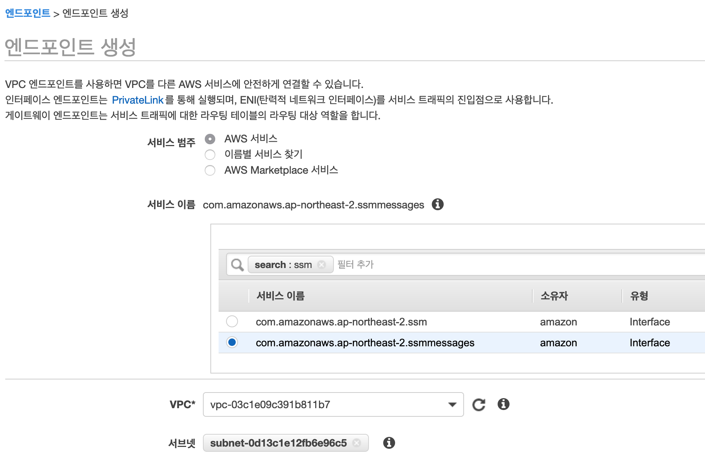
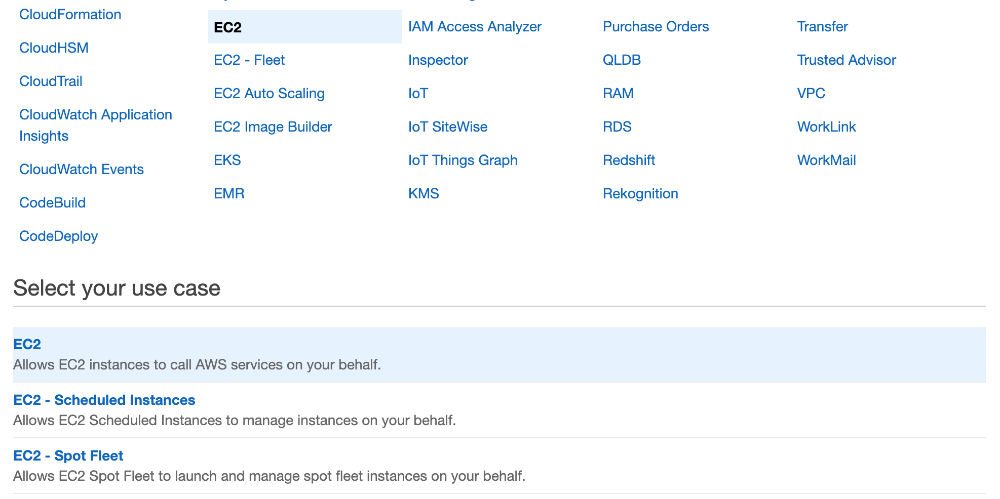

# 준비

실습을 위한 기초 환경을 만들어 놓습니다. 짧지 않습니다. Buckle up!

## 사용자 환경

### 웹 브라우저

웹 브라우저만 잘 갖추었다면 만족할 수 있습니다.
Microsoft Edge, Firefox, Google Chrome이 적합하다고 할 수 있습니다.
다시 말하면, Gecko 엔진과 Chromium 엔진을 사용하는 웹 브라우저라면 좋습니다.

### CLI

추가적으로 command line interface가 있으면 더 좋을 수 있습니다.
하지만, 기본적으로 이번 실습 과정에서는 Web Console을 중심으로 놓고 설명을 합니다.
여러분께서 사용하고 있는 운영체제에서 CLI를 지원하고 그 CLI에 AWS CLI를 설치할 수 있으면
됩니다. 만약 그런 환경이 갖추어지지 않았다거나 굳이 그런 수고를 들이고 싶지 않는다면
AWS에서 제공하는 Cloud9을 사용하는 것을 추천합니다.
혹은, EC2 instance 하나를 만들고, session manager로 접속해서 사용하셔도 무관합니다.
모두 결국에는 같은 환경입니다.

## AWS 환경 구축

### IP (대역) 할당

VPC과 Subnet을 다음의 같이 미리 만들어 놓습니다.
서로 다른 리전에 VPC를 배치하며 각 VPC는 하나 혹은 두 개의 Subnet을 보유하게 됩니다.
각 리전에서 가용영역(Availability Zone)은 일관성 있게 하나만 선택합니다.  
서울 리전의 경우, `ap-northeast-2a (apne2-az1)`을
아일랜드 리전의 경우, `eu-west-1b (euw1-az2)`을 선택합니다.

다음의 표는 각 구성이 가져가는 IP 관련된 정보입니다.  
목적은 각 VPC와 Subnet이 가지는 CIDR 영역이 겹치지 않게 하기 위함입니다.
이것은 예제일 뿐입니다. 각자가 더 창의적인 접근을 할 수 있으면 그것을 선택하시면 되겠습니다.

| Region             | VPC          | Subnet       | EC2 Instance | Additional Subnet|
|--------------------|--------------|--------------|--------------|--------|
| Region A (Ireland) | VPC 1        | Subnet 1-1   | Instance 1-1 |        |
|                    | 10.10.0.0/16 | 10.10.1.0/24 | 10.10.1.10   |        |
| Region A           | VPC 3        | Subnet 3-1   | Instance 3-1 |        |
|                    | 10.30.0.0/16 | 10.30.1.0/24 | 10.30.1.10   |        |
| Region B (Seoul)   | VPC 2        | Subnet 2-1   | Instance 2-1 | Subnet 2-2    |
|                    | 10.20.0.0/16 | 10.20.1.0/24 | 10.20.1.10   |10.20.2.0/24    |
| Region B           | VPC 4        | Subnet 4-1   | Instance 4-1 | |
|                    | 10.40.0.0/16 | 10.40.1.0/24 | 10.40.1.10   | |

위 정보를 기초로, 두 리전에 VPC들과 Subnet 그리고 EC2 Instances를 생성합니다.
생성이 완료되었다면, 이제 준비가 끝났습니다.

### VPC 및 Subnet 생성

위의 IP 할당표를 참조하여 각 리전에 VPC와 Subnet을 생성합니다.  
여러분께 VPC는 어떻게 만들고 Subnet은 왜 묵시적 라우팅이 가능한지 등에 대한 이야기를
다시 하는 건 매우 지루한 일이 될 것입니다.
다만, VPC를 생성하고 나서 하나의 옵션을 켜야 합니다.

### DNS 호스트 이름

생성한 VPC를 선택하고, '작업' 메뉴에서 'DNS 호스트 이름 편집'을 선택해서
'DNS 호스트 이름'을 활성화 해야 합니다. 이는 Session Manager로 EC2 instance에 접속하기 위한
Systems Manager의 요구사항입니다.

#### Private DNS 생성 (optional)

[엔드포인트 서비스의 프라이빗 DNS 이름](https://docs.aws.amazon.com/ko_kr/vpc/latest/userguide/verify-domains.html)

본 실습에서 이 부분은 다루지 않습니다. 하지만, 만약 이에 대한 관심이 있으시다면
위의 웹 링크로 안내하는, 공식 문서를 읽어보시는 것을 추천합니다.

### VPC endpoint 작성

이 과정은 반복적이어서 인내가 조금 필요합니다.

Systems manager의 session manager를 통하여 EC2 instance에 접근하기 위하여
VPC에 endpoints를 생성합니다, 3가지나 됩니다.
session manager로 EC2 instance에 접근하는 일반적인 방식은 대상이 되는 EC2 instance가
public subnet에 배치되어 있어야 합니다, 그리고 pubic IP를 지니고 있어야 겠죠.
하지만, 본 실습의 구성에서는 그런 행운같은 설정은 존재하지 않기에, 우리는 VPC endpoint에
Systems Manager가 접근할 수 있도록 설정을 해 놓아야 합니다. 그렇습니다, private subnet이
있고, 그 안에 EC2 instance가 있는 조건에서 필요한 조치입니다.

Endpoint를 생성은, web console에서 'VPC' 서비스를 선택하고 나타나는 왼쪽 메뉴에서 'Endpoints'를
선택한 다음, `Create Endpoint`{style='background-color:dodgerblue; color:white'}
버튼을 클릭하여 시작할 수 있습니다.

만들어야 하다는 endpoints는
`com.amazonaws.$REGION.ssm`,
`com.amazonaws.$REGION.ssmmessages`,
`com.amazonaws.$REGION.ec2messages`
이렇게 3가지입니다.

위 VPC endpoints는 EC2 instances가 배치된 모든 VPCs와 subnets에 적용해야 합니다.
본 과정의 경우에는 아일랜드 리전의 VPC 1/subnet 1-1과 VPC 3/subnet 3-1
그리고 서울 리전의 VPC 2/subnet 2-1과 VPC 4/subnet 4-1이 해당됩니다.

아래의 참조문서에서는 3가지 endpoints를 작성하는 것을 설명하고 있습니다.

!!! note "참조"
    [Systems Manager를 사용하여 인터넷 액세스 없이 프라이빗 EC2 인스턴스를 관리할 수 있도록 VPC 엔드포인트를 생성하려면 어떻게 해야 합니까?](https://aws.amazon.com/ko/premiumsupport/knowledge-center/ec2-systems-manager-vpc-endpoints/)  
    [How do I create VPC endpoints so that I can use Systems Manager to manage private EC2 instances without internet access?](https://aws.amazon.com/premiumsupport/knowledge-center/ec2-systems-manager-vpc-endpoints/)

### IAM 생성

Session manager가 EC2 instance에 권한을 가지고 접근할 수 있도록 조치합니다.
생성하는 IAM은 EC2 하위 Policy, `AmazonSSMManagedInstanceCore`를 포함하면 됩니다.
여기에서 생성한 IAM role은 EC2 instance를 생성할 때 지정해야 합니다.

당연히 그렇겠지만, EC2를 선택합니다. 'use case'도 EC2를 선택합니다.

Policy를 선택할 때, `AmazonEC2RoleforSSM`을 지정하셔도 정상 동작합니다. 하지만, 이 IAM Role은
곧 사라지게 됩니다. `AmazonSSMManagedInstanceCore`로 지정하고 기억 속에도 그렇게 남깁시다.

원하는 이름으로 Role name을 지정하고 생성하면 이 단계는 완료됩니다.

### EC2 instances 생성

그리고, 필요한 EC2 instance들을 생성합니다. 본 예제에서는 Ubuntu 18.04 LTS로 일부 특징적인
예제가 있어, 이것을 추천합니다. 만약 다른 AMI를 선택하신다면, Python이 별도의 설치 없이 동작하는지
확인하시기 바랍니다. 앞으로 진행될 실습에서 Python3 명령 한 줄이 나옵니다.
간이 웹 데몬을 실행하기 위함입니다. (물론, Python2에서도 가능합니다)

그리고 Session Manager를 위한 Systems Manager Agent가 미리 설치된
AMI를 선택하는 것이 상당히 유리합니다. 그 목록은 다음과 같습니다(Linux 한정, Windows 제외).

* Amazon Linux
* Amazon Linux 2
* Ubuntu Server 16.04
* Ubuntu Server 18.04
* Amazon ECS-Optimized

필요한 최소 instance의 수(數)는 총 넷입니다.  
만약 충분한 시간이 지금 있다면, VPC 4의 Subnet 4-1에 배포할 Instance 4-1, 단일 instance 대신
Auto scaling group으로 작성해 보신다면 보다 완벽한 실습이 되겠지만, 반드시 필요한 것은 아닙니다 :-)

EC2 instance를 만들면서 요구되는 Key를 미리 만들어 두든, instance 생성시 만들든 잘 보관해 둡시다.
서로 다른 VPC에 있는 instances 간의 접속 시험 때 사용할 수 있습니다.

### Systems Manager 설정

Systems manager의 설정은 따로 필요하지 않습니다. 생성한 IAM role이 EC2 instance에
잘 적용되어 있다면, Systems Manager 아래, 왼쪽 아래 메뉴,
'Instances & Nodes'에서 'Session Manager'를 선택, 전환되는 화면에서
`Start Session`{style='background-color:#e47911; color:white'}을
선택하고 나타는 화면에서 생성한 EC2 instances가 'Target Instances'에 나타나면 준비가 완료된 것입니다.

### Network Load Balancer 생성

VPC 4에 Network Load Balancer를 배치합니다. 해당 NLB는 비록 단 하나의 EC2 instance에
연결되지만, 우리의 시연에는 큰 문제가 없습니다.
다만, Target group에 대한 health check 시, 80이나 443
(우리는 지금의 환경에서 제대로된 웹 데몬을 항상 띄우지는 못 합니다)
포트가 아닌, 기본으로 오픈되어 있는 TCP 22번으로 설정하는 것이 필요합니다.

### NAT Gateway 생성

VPC 2의 Subnet 2-2에 해당 설정을 합니다.

### Internet Gateway 생성

VPC 2에 해당 설정을 합니다.

### 라우팅 테이블

지금은 따로 설정하지 않습니다.  
다만, NAT gateway와 Internet Gateway를 위한 설정은 아래와 같이 진행합니다.

#### Public Subnet, Subnet 2-2

VPC 2에 라우팅 테이블을 만들어 줍니다. 이 라우팅 테이블은, 0.0.0.0/0로 가는 길에 Internet gateway가 지정됩니다.
그리고 이 라우팅 테이블은, Subnet 2-2에 지정합니다.

#### Private Subnet, Subnet 2-1

VPC 2에 라우팅 테이블을 만들어 줍니다. 이 라우팅 테이블은, 0.0.0.0/0로 가는 길에 NAT gateway가 지정됩니다.
그리고 이 라우팅 테이블은, Subnet 2-1에 지정합니다.

### 보안 그룹

보안 그룹(Security Group)은 모두 열어 둡니다.

| Type 유형 | Protocol 프로토콜 | Port range 포트 범위 | Source 소스 | |
|------|----------|------------|--------|---|
|All traffic 모든 트래픽 | All 전체 | All 전체 | Custom 사용자 지정 | 0.0.0.0/0 |

`Custom 사용자 지정` 대신 `Anywhere 위치 무관`을 선택할 수도 있습니다.  
본 실습의 목표는 보안에 관한 조정이 포함되어 있지 않습니다.

위 설정은 본 실습을 위한 설정입니다. 만약 정교한 설정을 한다면 생각할 것이 많겠지만,
대부분 그 생각은 일반적일 것입니다. 제가 알리고 싶은 것은 Session Manager를 위한
security group의 설정입니다. [AWS Systems Manager > User Guide > Step 6: (Optional) Create a Virtual Private Cloud endpoint](https://docs.aws.amazon.com/systems-manager/latest/userguide/setup-create-vpc.html)를 참조할 수 있습니다.

完
