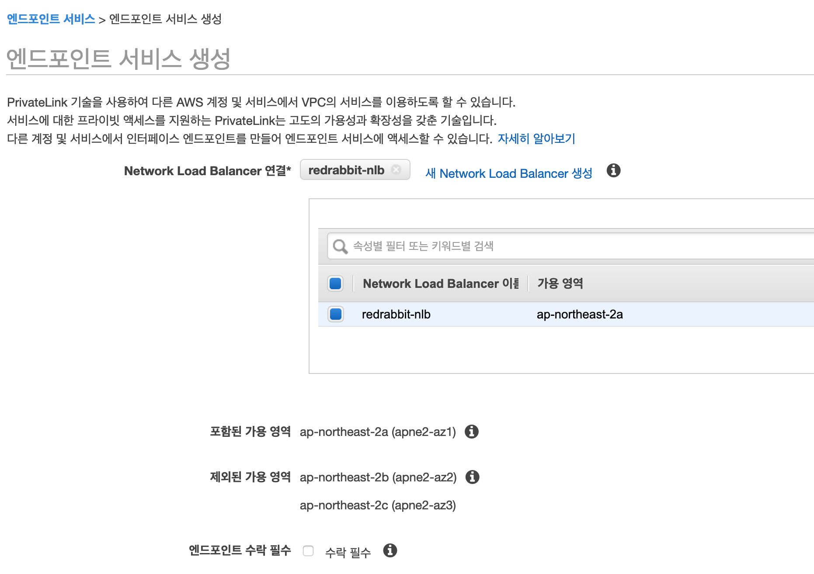
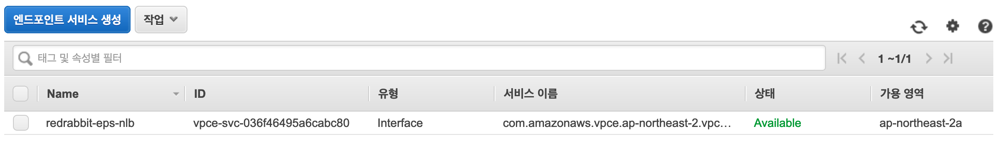
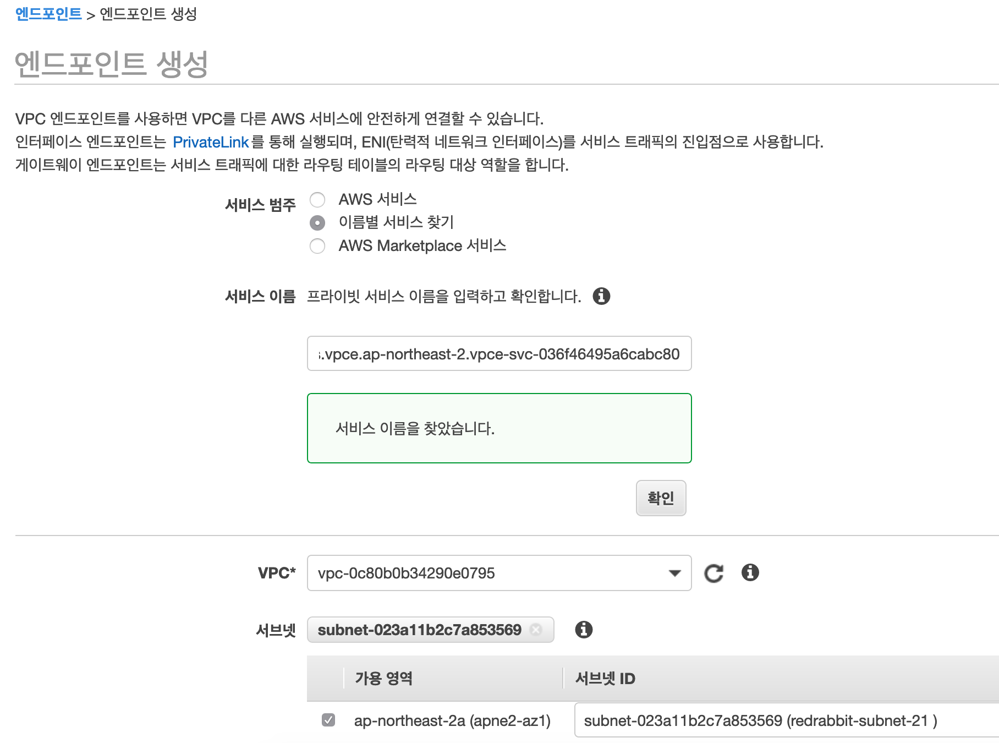

# 실습

## 목표

이번 실습에서는 서로 다른 VPC 사이를 연결하는데에 PrivateLink를 사용합니다.
VPC endpoint services를 활용 Network Load Balancer를 앞세운 웹 서비스를
하나의 endpoint로 작성합니다.
그리고, 다른 VPC에서 endpoint를 생성하고, 그 endpoint와 NLB가 엮여 있는 endpoint services를
묶어 PrivateLink를 완성하는 것입니다. 그림으로 다시 한 번 상세히 보면 아래와 같습니다.


우리는 본 실습을 통해 instance 2-1이 VPC 2의 interface endpoint를 이용하여
instance 4-1이 제공하는 서비스에 접속하는 것입니다.

## VPC endpoint services 생성

준비 단계에서 생성한 EC2 instance와 Network Load Balancer를 사용합니다.  
VPC endpoint services는 PrivateLink와 동의어로 취급해도 무관합니다.

**VPC > 가상 프라이빗 클라우드 - 엔드포인스 서비스**를 선택해서 들어갑니다.
그리고 화면 상단의 `엔드포인트 서비스 생성`{style='background-color:dodgerblue; color:white'}
을 클릭하여 엔드포인트를 생성합니다.

준비 단계에서 미리 만들어 놓은, NLB를 선택합니다.



기본으로 지정되어 있는, '엔드포인트 수락 필수' 항목은 선택하지 않습니다.
우리 시나리오에서는 모든 서비스의 소유권자가 단일 사용자이기 때문에
무용합니다. 만약, 서로 다른 소유권(계정과 이해 관계가 다른 사용자 사이)자들과
이와 같은 일을 계획한다면 상당히 합리적인 선택이 될 수 있습니다.



## VPC endpoint 생성

먼저, 이전 단계에서 생성해 놓은 VPC endpoint services의 **서비스 이름**을 '클립보드에 복사'해 둡니다.


**VPC > 가상 프라이핏 클라우드 - 엔드포인트**를 선택합니다.  
`엔드포인트 생성`{style='background-color:dodgerblue; color:white'} 버튼을 눌러 다음의
화면으로 진입합니다.



**서비스 범주**를 **이름별 서비스 찾기**를 선택합니다.  
**서비스 이름** 입력란에 클립보드에 복사해 둔 엔드포인트 서비스의 '서비스 이름'을 붙혀 넣습니다.
생성이 완료하면, 아래의 화면처럼 '상태'에 '대기 중'으로 나타납니다. 나머지 세 가지는
Systems Manager의 접속을 위해 만들어 둔 엔드포인트들입니다.


이제 다시, **VPC > 가상 프라이핏 클라우드 - 엔드포인트 서비스** 메뉴를 클릭하여 화면을 전환합니다.
아래와 같은 화면 출력을 보실 수 있습니다.

엔드포인트 서비스와 연결된 NLB가 보이고, 그 아래, '엔드포인트 연결' 탭을 열어 보면
이전 단계에서 생성한 VPC 2의 엔드포인트가 '대기 중' 상태로 연결을 기다리는 것을 확인할 수 있습니다.

<!--
 -->

'엔드포인트 연결'이 있는 탭 바로 아래 왼쪽을 살펴보면 '작업'이라는 버튼이 있습니다.
그 버튼을 눌러 '엔드포인트 연결 요청 수락'을 선택합니다. 물론, 지금 마음이 달라져
몇 분 전에 내가 했던 '요청'을 '거부'하는 것도 자유의지이긴 합니다 ;-)


'엔드포인트 연결 요청 수락'을 선택하면, 다시 한 번 사용자의 선택이 바른 것인지 스스로에게
물어볼 시간을 얻습니다. 변심의 여지가 없다면, `에, 수락`{style='background-color:dodgerblue; color:white'} 버튼을 눌러 의지를 표명하시면 되겠습니다.


잠깐의 시간이 흐른 뒤에 아래와 같이 '상태'가 '**사용 가능**'으로 변경되는 것을 확인할 수 있습니다.
사용자도 할 일을 끝내고, 시스템도 할 일을 모두 끝낸 시점입니다.


여기까지 오셨다면 설정은 모두 끝난 것입니다.  
이제 VPC 2에 배포되어 있는 instance 2-1로 접속해서 (session manager를 사용하여)
직전에 생성한 VPC 엔드포인트로 웹 접속을 해 봅니다. VPC 엔드포인트의 주소는 아래의 그림과 같이
해당 엔드포인트의 '세부 정보'의 'DNS 이름'[^1]으로 알 수 있습니다.

[^1]: 'DNS 이름'이라는 명칭은 혼란을
    줄 수 도 있습니다, 기술적으로는 FQDN(Full Quantified Domain Name)이 맞지 않나 싶습니다.
    엄밀히 말해서 DNS 이름은, Domain Name Server(Service)의 이름으로, DNS-01, NS-WEST-BAY17
    뭐 이런 식이어야 할 듯 합니다.


VPC 4에 있는 instance 4-1에 접속해서, 간단한 HTML 파일을 만들어 둡니다.
plain text 문서를 index.html로 작성해 두어도 아무런 문제가 되지 않습니다.
Linux/UNIX 커멘드 라인이 익숙하지 않으시다면 vi 편집기가 불편하다고 느껴지신다면
아래의 명령을 복사해서 사용하세요.

Session manager를 사용하여 이제 막 instance 4-1에 접속했다고 가정합니다.

```bash
sudo su - ubuntu
mkdir ./web; cd ./web
echo 'hello world, this is instance 4-1' > ./index.html
```

정상적으로 파일이 만들어 졌는지 확인합니다.

```bash
$ cat ./index.html
hello world
$ 
```

지금 단계에서 우리가 만든 모든 instance는 외부와 접속이 되지 않습니다. private subnet에
위치해 있고, 다른 연결 방식은 없습니다. 따라서 웹 서버를 설치하기가 용이하지 않습니다.
그래서, 기본으로 설치되어 있는 python의 기능 하나를 활용하기로 합니다.

아래의 내용은, python으로 간단 웹 데몬을 하나 동작시키는 것입니다.
반드시 index.html이 있는 디렉토리에서 명령 내려야 합니다.

아래의 명령 예제는 session manager로 instance 4-1로 이제 접속한 상태를 가정한 것입니다.
위의 작업에 이어서 진행한다면, `sudo su - ubuntu`와 `cd ./web`은 명령할 필요는 없습니다.

```bash
$ sudo su - ubuntu
ubuntu@ip-10-40-1-10:~$ cd ./web
ubuntu@ip-10-40-1-10:~/web$ cat ./index.html
<html>
        <head><title>Test from Instance 4-1</title></head>
        <body>
                Hello World; this is Instance 4-1

        </body>
</html>
ubuntu@ip-10-40-1-10:~/web$ sudo python3 -m http.server 80
Serving HTTP on 0.0.0.0 port 80 (http://0.0.0.0:80/) ...
```

만약 여러분께서 선택하신 AMI가 Python3를 가지고 있지 않다면,
Python2 정도는 기본으로 설치되어 있기를 바랍니다. Python2의 경우
명령은 다음과 같습니다.

```bash
$ python -m SimpleHTTPServer 80
```

이제 세션 메니저로 VPC 2에 배포해 둔, instance 2-1에 접속합니다.
그리고 VPC 2에 만들어 놓은 (그리고 VPC 4의 NLB를 품고 있는 VPC 엔드포인트 서비스와
연결되어 있는) VPC 엔드포인트의 주소로 `curl` 명령을 내려 모든 것이 제대로 동작하는지
확인합니다.

문제가 없다면 아래의 예시와 같은 화면 출력을 보실 수 있습니다.

```bash
$ sudo su - ubuntu
To run a command as administrator (user "root"), use "sudo <command>".
See "man sudo_root" for details.

ubuntu@ip-10-20-1-10:~$ curl vpce-0b10227a244aa9730-dybhspou.vpce-svc-036f46495a6cabc80.ap-northeast-2.vpce.amazonaws.com
<html>
        <head><title>Test from Instance 4-1</title></head>
        <body>
                Hello World; this is Instance 4-1

        </body>
</html>
ubuntu@ip-10-20-1-10:~$ 
```
instance 4-1에 작동시켜 놓은 python 웹 데몬에서 아래와 같이 접속이 이루어졌음을 확인할 수 있습니다.

```bash
$ sudo su - ubuntu
ubuntu@ip-10-40-1-10:~$ cd web
ubuntu@ip-10-40-1-10:~/web$ cat ./index.html
<html>
        <head><title>Test from Instance 4-1</title></head>
        <body>
                Hello World; this is Instance 4-1

        </body>
</html>
ubuntu@ip-10-40-1-10:~/web$ sudo python3 -m http.server 80
Serving HTTP on 0.0.0.0 port 80 (http://0.0.0.0:80/) ...
10.40.1.80 - - [20/Jun/2020 11:31:05] "GET / HTTP/1.1" 200 -
10.40.1.80 - - [20/Jun/2020 11:31:28] "GET / HTTP/1.1" 200 -
10.40.1.80 - - [20/Jun/2020 11:31:53] "GET / HTTP/1.1" 200 -
```


