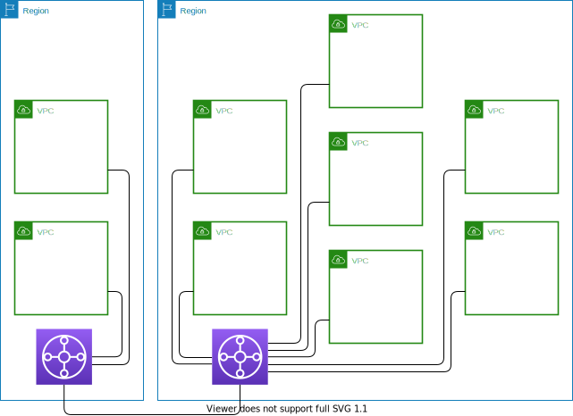

# 개요

Transit Gateway는 서로 다른 네트워크를 하나로 연결해 줍니다.
일종의 허브와 같은 역할을 하며 연결 이외의 기능은 없습니다. 하지만,
단 하나의 기능이 많은 것을 해결하는 경우가 있습니다.

## Transit Gateway의 유용성

### VPC Peering과 비교

흔희 Transit Gateway의 유용성을 설명할 때 대칭에 놓는 것은 VPC peering입니다.
일단, 아래의 그림을 보겠습니다.


VPC peering으로 VPC 7개를 연결했습니다. Full-mesh 연결입니다. 복잡합니다.
네, 조금 더 복잡하게 보이라고 제가 마우스를 이리저리 돌린 경향이 없지않아 있습니다.
하지만, 연결 선의 개수를 정확합니다. 그럼, 다음의 그림을 보겠습니다.


복잡해 보였던 VPC peering 연결을 위 그림처럼 transit gateway로 단순화 시킬 수 있습니다.
이 그림은 어떤 의도를 결부시키더라도 더 복잡하게 보이게 하거나 더 단순하게 보이게 하기가 어렵습니다.

연결선의 개수만 따져보면, VPC peering은 21개인데 transit gateway는 단 7개입니다.

```math
n(n-1)/2
```

VPC peering으로 full-mesh 형태의 연결을 구상할 때 총 필요한 연결의 개수는 위에 적혀 있는
매우 간단한 산술식으로 예상할 수 있습니다. 만약 10개의 VPC를 peering으로 연결한다면
10(10-1)/2 = 45,
45개의 연결이 필요하다는 계산을 할 수 있습니다.

Transit gateway로 VPC를 연결할 때 다른 region간의 연결도 아래의 그림처럼 가능합니다.



위 그림에서 짐작할 수 있듯이 transit gateway는 region에 종속됩니다.
따라서 다른 region과의 연결은 각 region에 transit gateway를 두고
각 region에 있는 transit gateway를 peer로 연결함으로 구성할 수 있습니다.

Transit gateway는 단순히 VPC 간의 연결 뿐만 아니라,
site-to-site VPN도 수용하고 있습니다.
그리고 direct connect의 direct connect gateway도 연결할 수 있습니다.
그래서, transit gateway는 지금까지 시장에 선보인 어떤 연결 구성 방식보다
많은 것을 수용하고 가장 간단한 구성을 가지고 있습니다.

다음의 단계에서부터 수행하면서 알게 되는 부분이기도 하지만,
transit gateway는 VPC 간의 연결을 꾀하지만, 연결의 단위는 subnet입니다.
즉, 서로 다른 VPC 내에 있는 subnet을 서로 연결함으로써
VPC 간의 연결을 가져오게 됩니다 - 어쩌면 당연한 것이기도 합니다.
VPC 내의 subnet을 transit gateway로 연결한다고 하여, 연결되는 subnet
이외의 subnet에 있는 자원은 transit gateway로 연결할 수 없는 것은 아닙니다.
이 부분은 route table이 해결해 줍니다.

Route table은 transit gateway의 핵심 구성 요소라고도 할 수 있습니다.
모든 연결의 정의는 route table로 이루어집니다. 단순히 transit gateway가
연결(attached)되었다고 통신이 되는 건 아닙니다. 우리가 기억해 낼 수 있는
많은 네트워크 장비들이 그러하듯 말이죠. route table을 설정함으로써 연결성을 확보한다는
이야기는 달리 말하면 연결을 제어할 수 있다는 말도 됩니다. transit gateway는
route table 설정으로 특정 연결을 허용하거나 불허할 수도 있습니다.

AWS 공식 한국어 문서에서는 'transit gateway'를 '전송 게이트웨이'로 번역하고 있습니다.
본 문서에서는 원어 그대로인, transit gateway 혹은 약어, TGW로 표기합니다.
