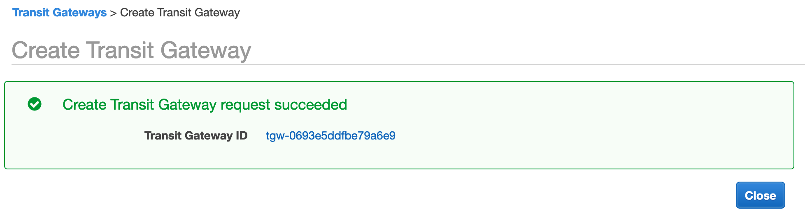
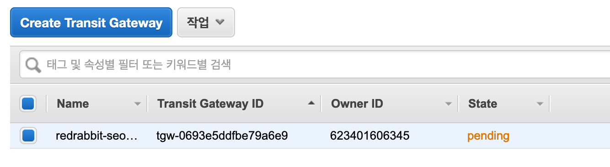
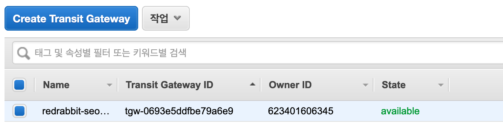
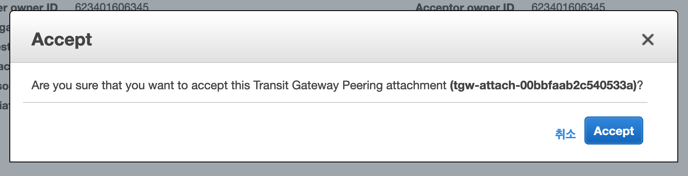
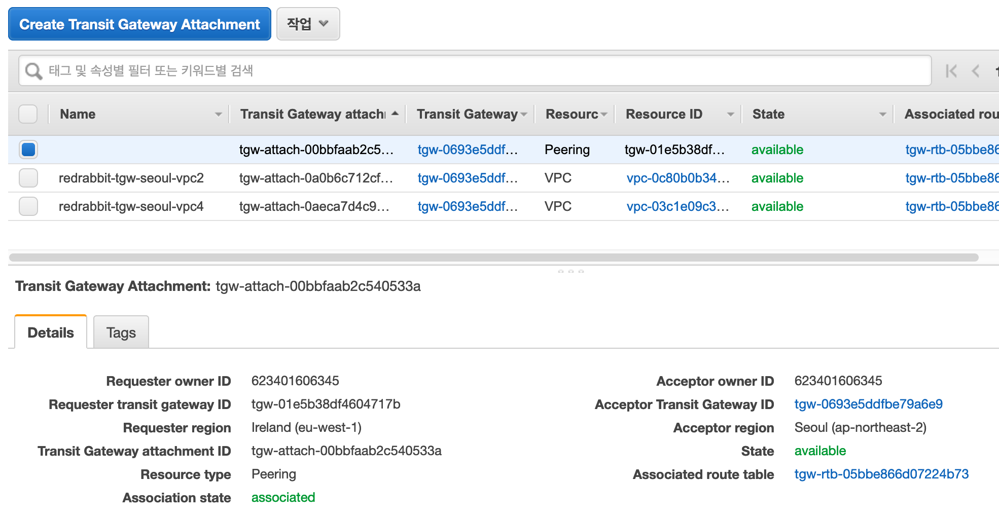
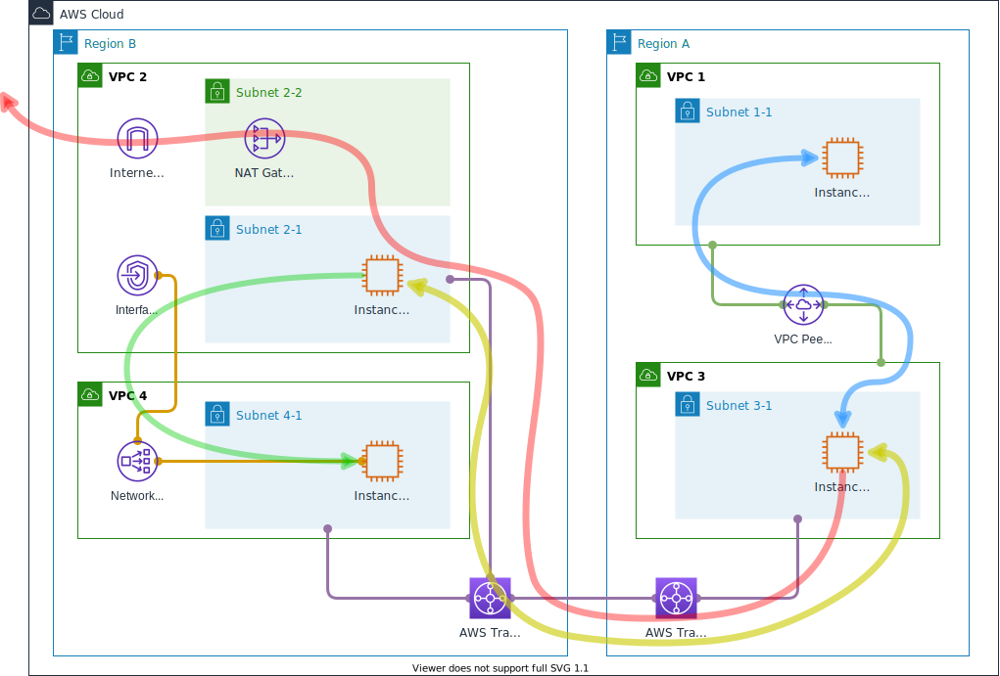

# 실습

시작은 예상하는 것과 같이 console > VPC > Transit Gateway - Transit Gateway 메뉴를 선택하는 것입니다.
`Create Transit Gateway`{style='background-color:dodgerblue; color:white'} 버튼을 눌러 시작합시다.

## Transit Gateway 생성 (서울)


이름을 입력하고, ASN은 기본값을 가져 갑니다. 만약 다른 TGW나 BGP(Border Gateway Protocol)을 사용하는
그래서, ASN을 가지게 되는 다른 서비스와 충돌이 예상되면 이 값을 변경합니다.
ASN은 하나의 네트워크 안에서 고유한 번호를 서비스가 가지면 됩니다. 

ASN 값의 범위는 다음과 같습니다.

```
16비트 ASN의 경우 값의 범위: 64512 - 65534
32비트 ASN의 경우 값의 범위: 4200000000 - 4294967294
```

나머지에 대해서 추가 설정할 부분은 지금은 없습니다.



생성 완료되었다는 화면 출력을 맞이하고 `Close`{style='background-color:dodgerblue; color:white'}
버튼을 눌러 고개를 끄덕이는 행위를 대신하면 다음의 화면을 만날 수 있습니다.



몇 분 정도 기다리면 - 서비스 생성에 문제를 발견하지 못 했다면 - Status가 아래와 같이 변경되어 출력됩니다.
자동으로 화면이 갱신되지는 않습니다. 우측 상단에 서로의 꼬리를 향해 돌진하는 화살표 두개가 그려내느 원형의 아이콘을 클릭해야 합니다 :-)



### VPC와 연결

VPC 서비스 내 좌측 메뉴, Transit Gateway 하위 `Transit Gateway 연결`을 눌러 VPC 연결 설정에 들어갑니다.


준비 단계에서부터 생성해 두었던 VPC 중에 서울 리전에 있는 VPC 2와 VPC 4를 하나씩 연결합니다.
현재 각 VPC에는 단일 subnet이 존재합니다. 그래서 자동으로 해당 subnet이 선택되는데,
복수개의 subnet이 있으면 연결 대상을 선택할 수 있습니다.
우선, 가용영역(Availability Zone - 以下 AZ)으로 나뉘며 같은 AZ내 여러 subnet이 있으면 pull down 메뉴로 다시 
선택 가능합니다.


우리는 아래와 같은 화면을 만나는 것이 즐겁습니다, 때론 작은 안도를 느끼기도 하죠.


같은 방식으로 Transit Gateway에 VPC 4도 연결합니다.  
두 VPC가 모두 잘 연결이 되었다면, 아래와 같은 화면을 만나게 됩니다.


우리는 이 설정으로 VPC 2와 VPC 4에 각각 배치되어 있는 instance 2-1과 instance 4-1을 직접
연결할 수 있을 것이라는 기대를 할 수 있습니다. Session manager로 연결하여 상호 교신을 확인합니다.

```bash
ubuntu@ip-10-20-1-10:~$ ping 10.40.1.50 -c 3
PING 10.40.1.10 (10.40.1.10) 56(84) bytes of data.
64 bytes from 10.40.1.10: icmp_seq=1 ttl=63 time=0.714 ms
64 bytes from 10.40.1.10: icmp_seq=2 ttl=63 time=0.610 ms
64 bytes from 10.40.1.10: icmp_seq=3 ttl=63 time=0.502 ms

--- 10.40.1.10 ping statistics ---
3 packets transmitted, 3 received, 0% packet loss, time 2026ms
rtt min/avg/max/mdev = 0.502/0.608/0.714/0.091 ms
ubuntu@ip-10-20-1-10:~$
```

```bash
ubuntu@ip-10-40-1-10:~$ ping 10.20.1.10 -c 3
PING 10.20.1.10 (10.20.1.10) 56(84) bytes of data.
64 bytes from 10.20.1.10: icmp_seq=1 ttl=63 time=0.736 ms
64 bytes from 10.20.1.10: icmp_seq=2 ttl=63 time=0.620 ms
64 bytes from 10.20.1.10: icmp_seq=3 ttl=63 time=0.646 ms

--- 10.20.1.10 ping statistics ---
3 packets transmitted, 3 received, 0% packet loss, time 2037ms
rtt min/avg/max/mdev = 0.620/0.667/0.736/0.054 ms
ubuntu@ip-10-40-1-10:~$
```

이제 서울 리전에서의 Transit Gateway 설정은 끝났습니다.
같은 방식으로 아일랜드에서도 Transit Gateway를 생성하고 구성합니다.

## Transit Gateway 생성 (아일랜드)

몇 가지 변수만 생각한다면 반복되는 것이라 크게 다른 점이 없습니다.
다만, `Amazon side ASN` 값이 항상 `64512`를 가지고 있다는 점입니다.
우리는 아일랜드에서 만들 때는 1을 더해서 `64513`으로 하십시다.

항상 아일랜드에서 만드는 서비스/리소스들이 먼저 수를 시작하는데,
아쉽습니다. 하지만, 아일랜드에는 홀수를 서울에는 짝수를 배치한 것을 생각하면
순서는 아쉽지만 나머지 규칙은 맞아 떨어지는 것 같아 뭐, 괜찮다고 봅니다 ;-)

생성에 관한 스크린샷은 큰 의미가 없다고 봅니다. 그래서 작업의 순서만 아래에 적어 보겠습니다.

1. `Create Transit Gateway`{style='background-color:dodgerblue; color:white'}  
    Amazon side ASN 값을 기본값이 아닌 값, 서울 리전에 만들어 둔 그것과는 다른 값을 입력
1. `Create Transit Gateway Attachment`{style='background-color:dodgerblue; color:white'}  
    같은 리전에 있는 VPC 3를 등록

## Transit Gateway Peering

이제 서울과 아일랜드 리전에 만들어 둔 두 Transit Gateway를 서로 엮습니다.

서울 아일랜드 어느 쪽 Transit Gateway에서 시작해도 무관합니다.
아래의 예제는 현재 console 창이 아일랜드일 확률이 높기 때문에 그곳에서 시작합니다.

### 연결

VPC > Transit Gateway - Transit Gateway 연결, 로 갑니다.
`Create Transit Gateway Attachment`{style='background-color:dodgerblue; color:white'}를
눌러 시작합니다. 아래의 그림은 바로 다음 단계에서 만나게 되는 화면입니다.
이전의 '연결'과 다른 점은 눈에 띄일 것입니다. 이제 VPC를 선택하지 않고, Peering을 선택해서 진행합니다.


'Peering Connection Attachment' 하위, 사용자가 입력할 수 있는 창의 마지막을 보시면,
'Transit gateway (accepter)*'가 보입니다. 그곳에 입력할 값은 peering을 맺을
상대편 transit gateway의 ID입니다. 창(혹은 탭)을 하나 더 열어 서울 리전에 만들어 놓은
transit gateway의 ID를 알아내어(복사하여) 이 입력창에 (붙혀) 넣습니다.
아쉽지만 자동으로 찾아내어 주지는 않아요 :-/


이렇게 생성하고 나면, 위 그림에서 보이는 것과 같이 새로 생성된 attachment가 있고,
State이 `initial request`로 나타납니다. 이 즈음되면 본능적으로
서울 리전에 있는 상대편 transit gateway를 보고 싶어질 것입니다.

아래의 그림은 서울 리전의 transit gateway의 '연결 Attachments' 화면입니다.
뭔가 사용자에게 해 달라고하는 듯 한 압박이 느껴지는 오렌지色 글자가 보입니다.
`pending acceptance`


상단 '작업' 버튼을 눌러, 'Accept'을 선택합니다. 번역의 빈곳이 많군요.
참, 물론 스스로 한 요청이고 스스로가 해야할 수락이지만, 이 순간 마음에 들지 않는다면
'Reject' 거절을 선택하실 수도 있습니다.


정말 수락하는 것이 맞는지, 사용자의 행동에 대해 console은 의문을 제기하지만
우리는 이 의문을 간단히 해소시킬 수 있습니다. 오랫동안 훈련한 것과 같이
`Accept`{style='background-color:dodgerblue; color:white'}를 눌러 주십시다.



그럼, 커피를 내려서 가져올 수도 있고 담배를 한 대 피워 볼 수 있는 시간이 흐른 뒤에 State은
아래와 같이 달라집니다 - 아무런 문제가 없다면 말이죠. 이제 거의 모든 준비는 끝났습니다.  
바로 아래의 화면은 '서울'의 그것이고



이 아래의 화면은 '아일랜드'의 그것입니다. 모두 녹색의 Available이라고 나오면 됩니다.


### 라우팅 테이블

Transit gateway가 있음으로써 복잡하게 생각해야 할 라우팅 테이블은 기본적으로
위의 과정을 거치면서 자동 설정이 됩니다. 그럼에도 불구하고 스스로 차근차근 길을
떠나보고 싶다면, 다음의 공식 문서를 참조하는 것이 좋겠습니다.

본 실습에서는 사용자가 직접 수행해야 하는 부분, 즉 VPC에 종속된 라우팅 테이블의
설정을 다루겠습니다. 이 즈음에서 '준비' 과정에서 봤던 그림을 한 번 더 보겠습니다.

[](../../images/networking/objective-flow.svg)

### 목표

- instance 4-1이 instance 3-1과 상호 통신이 되어야 합니다.  
  `ping`과 `ssh`를 해 보십시다.
- Instance 3-1은 VPC 2의 Subnet 2-2에 배포되어 있는 NAT gateway를 통하여 외부와 통신되어야 합니다.  
  Instance를 생성하는 데에, Debian 계열(Ubuntu) 배포판을 사용했다면, `sudo apt update`와 `sudo apt upgrade`를 통해서 운영체제를 갱신해 봅시다.
  혹시 다른 계열이라면, 아마도 `dnf`나 `yum` 명령이 유효할 것입니다.


### 라우팅 테이블 설정

Instance 3-1의 행로를 따라가면, 다음의 route tables를 설정해야 하는 것을 알 수 있습니다.

1. Subnet 3-1이 연계되어 있는 route table
1. VPC 3와 연결되어 있는 Transit Gateway (Ireland; 이하 tgw-irl)의 route table
1. tgw-irl과 peering되어 있는 Transit Gateway (Seoul; 이하 tgw-sel)의 route table
1. tgw-sel과 연결되어 있는 VPC 2의 subnet 2-1의 route table
1. tgw-sel과 연결되어 있는 VPC 4의 subnet 4-1의 route table

#### VPC 3의 경우

Instance 3-1이 속해 있는 subnet 3-1과 연동되어 있는 route table을 다음과 같이 설정합니다.


이전 VPC 1과의 peering 구성으로 마지막 행에 보이는 값이 등록되어 있었습니다.
여기에 `0.0.0.0/0`를 기입하고 tgw-irl로 향하게 추가 값을 넣었습니다.

#### TGW-IRL의 경우

Transit gateway를 위한 route table은 기존의 route table과는 다른 곳에 마련되어 있습니다.
VPC > Transit Gateway - Transit Gateway 라우팅 테이블, 에 있습니다.


VPC 3의 연결 구성은 이미 존재하고 있을 것입니다. Transit gateway에 VPC를 연결하면
해당 열을 자동으로 생성됩니다.
그림에서 마지막 열의 Resource Type, Peering으로 된 항목을 지금 기입하셔야 합니다.
해당 transit gateway, tgw-irl로 들어오는 요청에 대해 어디로 그 신호를 보낼 것인지 결정하는 것입니다.

- `0.0.0.0/0`을 tgw-sel로 보내고,
- 서울 리전에 있을, VPC 2로 향하는 신호를 위하여 10.20.0.0/16을 peering 맺어져 있는 tgw-sel로 보내고,
- 역시 서울에 있을, VPC 4로 향하는 신호를 위하여 10.40.0.0/16을 peering 맺어져 있는 tgw-sel로 보냅니다.

그런 의미의 값들입니다.

#### TGW-SEL의 경우


- (tgw-irl로부터 왔을) `0.0.0.0/0`으로 향하는, 그러니까 인터넷의 바다로 향하는 신호는
VPC 2로 보내고,
- 10.20.0.0/16을 찾는 분들을 VPC 2로 안내하고,
- 10.30.0.0/16을 찾는 친구들은 바다를 건너 대륙을 지나 tgw-irl로 안녕하고,
- 10.40.0.0/16을 찾는 신호들은 VPC 4로 연결하는 구성입니다.

#### VPC 2의 경우

VPC 2의 경우 두 개의 성격이 다른 subnets을 위해서 route table이 두 개 존재합니다.


Private subnet, subnet 2-1을 위한 구성입니다. subnet 2-1은 subnet 2-2와 달리 tgw-sel에 연결됩니다.

- 첫 행은 기본값입니다. 
- 인터넷으로 `0.0.0.0/0` 향하는 패킷들을 NAT gateway로 인도합니다.
- `10.30.0.0/16` VPC 3로 가는 신호들을 tgw-sel로 보냅니다.
- `10.40.0.0/16` VPC 4로 가는 신호들을 tgw-sel로 보냅니다.


Public subnet, subnet 2-2의 route table 구성입니다.

- 첫 행은 생존을 위한 기본값입니다.
- `0.0.0.0/0` 인터넷으로 향하는 패킷들은 Internet Gateway로 연결시켜 줍니다.
- `10.30.0.0/16`을 찾는 패킷들은 tgw-sel로 우선 안내합니다.

#### VPC 4의 경우


VPC 4는 특별할 것 없이, VPC 2와 VPC 3와의 연결 유지를 위하여 두 열을 추가하였습니다.
모두 tgw-sel로 향하게 길을 안내합니다.
