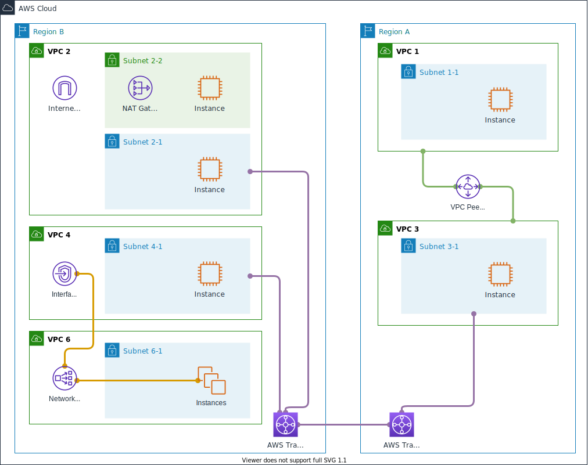

# 실습

VPC peering은 '준비' 단계에서 생성해 놓은 아일랜드 리전의 두 VPC를 사용할 것입니다.
VPC 1과 VPC 3입니다. 아래의 그림에서는 Region A에 속하며 우측에 해당되는 영역입니다.



## 연결 설정

VPC peering에는 요청자(requester)와 수락자(accepter)로 역할이 나뉩니다.  
VPC 1이 요청자가 되고, VPC 3이 수락자가 됩니다.
혹은 그 반대가 되어도 무관합니다.

### 연결 요청


연결 요청을 완료하면 아래와 같이 '요청' 성공을 알리는 화면을 마주하게 됩니다.


### 연결 수락

요청받은 VPC에서 '요청 수락'을 통해 연결을 허용할 수 있습니다.


이로써, VPC 1과 VPC 3은 서로 peering이 맺어지게 된 것입니다.

#### 연결 상태 확인

피어링 연결 화면에서 아래와 같이 '상태'가 '활성'이라고 표시되면 '요청'과 '수락'이 정상적으로 완료되었다는 것을 의미합니다.


## 기타 설정 및 확인

라우팅 테이블과 보안 그룹(security group)의 조정은 상식 선에서 진행하면 되겠습니다.
VPC 1의 inbound는 VPC 3에 한정하는 설정을 가져 갑니다.

### 라우팅 테이블 설정

VPC 1의 subnet 1-1에 연결될 route table을 아래와 같이 편집합니다.
VPC 3의 CIDR 영역인, 10.30.0.0/16'을 입력하고, 'Peering Connection'을 선택하여
이전 단계에서 완성한 peering의 ID 값을 찾아 넣습니다.


같은 방식으로 VPC 3의 subnet 3-1에 연결될 route table을 편집하여
아래와 같은 결과를 만들어 냅니다.


#### 라우팅 테이블 설정 결과

VPC 1의 경우


VPC 3의 경우


#### 서브넷 연결 편집

편집한 route table을 목적하는 subnet과 연결을 합니다.  
아래는 VPC 1의 subnet 1-1을 연결한 결과입니다.


아래는 VPC 3의 subnet 3-1과 연결한 결과입니다.


### 보안 그룹 설정

모든 트래픽 - 전체 - 전체 - 0.0.0.0/0 으로 설정해도 무방합니다만,
본 학습의 목표인 한정된 트래픽을 구상하는 것을 반영한다면,
아래와 같이 VPC 1과 연관되는 보안 그룹의 설정을 하는 것이 좋겠습니다.
VPC 1에는 VPC 3로부터 진입하는 통신만 허용하게 됩니다.


### 연결 확인

instance 1-1과 instance 3-1은 서로 자유롭게 통신할 수 있게 설정했습니다.
우리가 익히 잘 알고 있는 `ping` 명령으로 상호 응답을 하는지 확인하겠습니다.

세션 메니저로 각 instance에 연결하여 다음과 같이 확인해 봅시다.

VPC 1의 subnet 1-1에 있는 instance 1-1에서 수행한 결과입니다.

```bash
ubuntu@ip-10-10-1-10:~$ ping 10.30.1.10 -c 3
PING 10.30.1.10 (10.30.1.10) 56(84) bytes of data.
64 bytes from 10.30.1.10: icmp_seq=1 ttl=64 time=0.430 ms
64 bytes from 10.30.1.10: icmp_seq=2 ttl=64 time=0.514 ms
64 bytes from 10.30.1.10: icmp_seq=3 ttl=64 time=0.502 ms

--- 10.30.1.10 ping statistics ---
3 packets transmitted, 3 received, 0% packet loss, time 2025ms
rtt min/avg/max/mdev = 0.430/0.482/0.514/0.037 ms
ubuntu@ip-10-10-1-10:~$
```
VPC 3의 subnet 3-1에 있는 instance 3-1에서 수행한 결과입니다.

```bash
ubuntu@ip-10-30-1-10:~$ ping 10.10.1.10 -c 3
PING 10.10.1.10 (10.10.1.10) 56(84) bytes of data.
64 bytes from 10.10.1.10: icmp_seq=1 ttl=64 time=0.373 ms
64 bytes from 10.10.1.10: icmp_seq=2 ttl=64 time=0.436 ms
64 bytes from 10.10.1.10: icmp_seq=3 ttl=64 time=0.499 ms

--- 10.10.1.10 ping statistics ---
3 packets transmitted, 3 received, 0% packet loss, time 2054ms
rtt min/avg/max/mdev = 0.373/0.436/0.499/0.051 ms
ubuntu@ip-10-30-1-10:~$
```
위와 같이 통신에 문제가 없다고 판단할 수 있다면, VPC 1와 VPC 3 간의 VPC peering은
성공적으로 설정이 되었다 판단할 수 있습니다.
