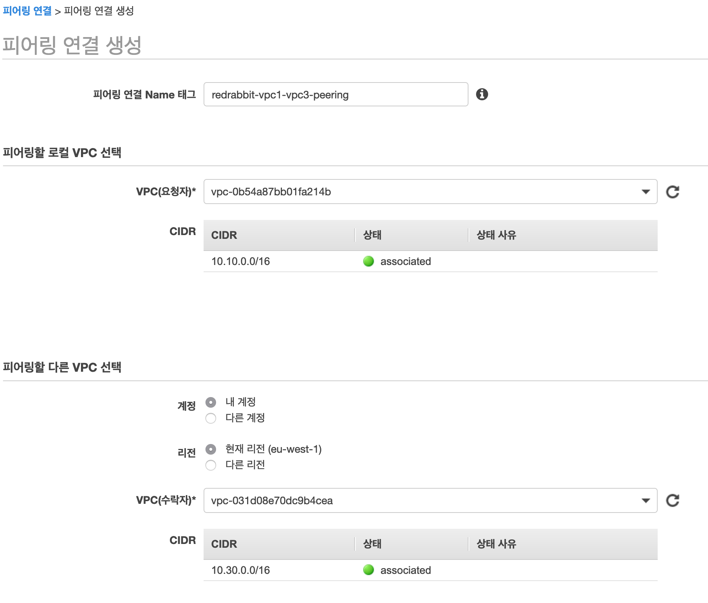
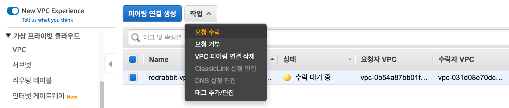
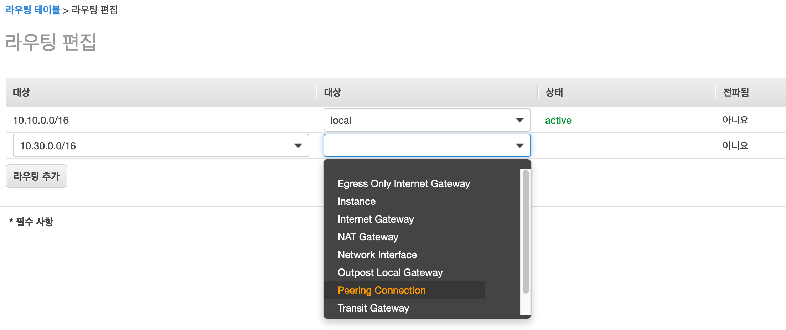
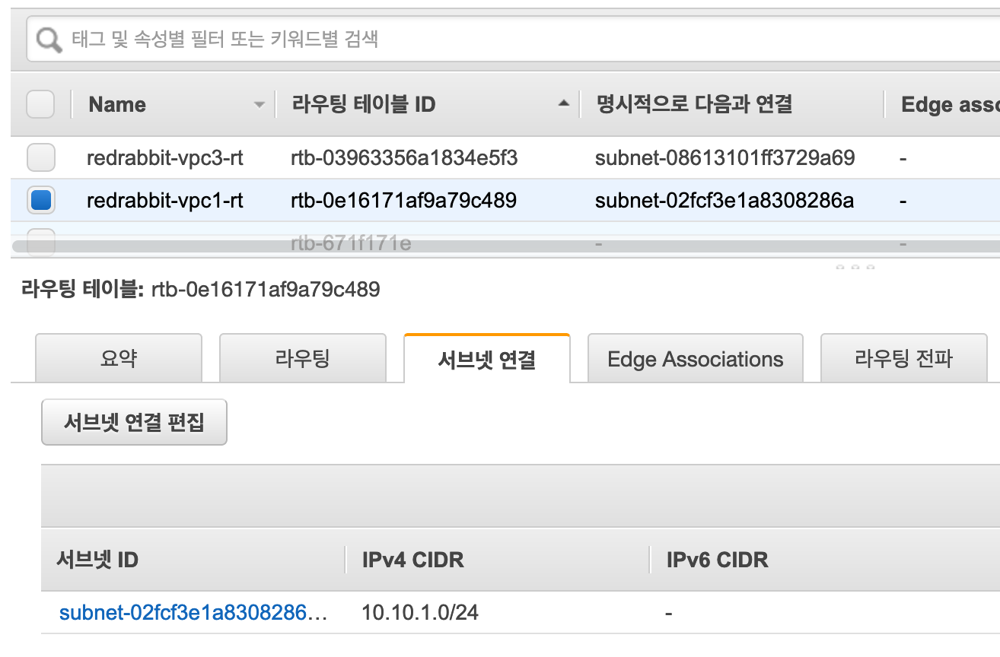

# 실습

VPC peering은 '준비' 단계에서 생성해 놓은 아일랜드 리전의 두 VPC를 사용할 것입니다.
VPC 1과 VPC 3입니다. 아래의 그림에서는 Region A에 속하며 우측에 해당되는 영역입니다.
우리는 시작하면서 Region A를 아일랜드로 정하기로 했던 것 같습니다. 하지만,
어느 리전이든 Transit Gateway가 배포될 수 있는 리전이면 만족할 수 있습니다.

완성된 구성에서는 instance 1-1과 instance 3-1이 상호 자유로운 통신이 가능해야 합니다.


## 연결 설정

VPC peering에는 요청자(requester)와 수락자(accepter)로 역할이 나뉩니다.  
본 예제에서는 VPC 1이 요청자가 되고, VPC 3이 수락자가 됩니다.
물론 그 반대로 작업하셔도 결과에 영향을 주지는 않습니다.

### 연결 요청

**VPC > 가상 프라이빗 클라우드 - 피어링 연결**을 선택고,
화면에 보이는 `피어링 연결 생성`{style='background-color:dodgerblue; color:white'}
버튼을 눌러 시작합니다.


입력해야 할 부분은 그렇게 많지 않습니다. 먼저 '항상' 그렇듯이 이름을 정해 줍니다.
그리고, 요청자와 수락자를 선택합니다. **VPC 요청자**는 VPC 1이 될 것이며,
**VPC 수락자**는 VPC 3이 될 것입니다.

자연스럽게 다른 선택은 이미 결정이 되었습니다. **내 계정** 그리고 **현재 리전(eu-west-1)**이 되겠습니다.



이렇게 진행하면, '피어링 연결 생성'이 성공적으로 요청되었다는 화면을 '확인'하게 됩니다.
이제 상대편 VPC, VPC 3에서 지금의 요청을 수락할 수 있게 합시다.


### 연결 수락

같은 화면에서 아래와 같이 **작업** > **요청 수락**으로 VPC 피어링을 맺을 수 있습니다.
다음 화면들은 그 단계를 차례대로 보여 줍니다.




이로써, VPC 1과 VPC 3은 서로 peering이 맺어지게 된 것입니다.

#### 연결 상태 확인

앞선 과정이 순조로왔다면, 아래의 그림처럼, 해당 peering의 '상태'가 **활성**으로 나타날 것입니다.


실질적인 세팅은 여기서 끝이 납니다. 이제 부가설정이라고 할 수 있는 라우팅 테이블을 손보고,
각 VPC 내에 배포되어 있는 서로 다른 instances 사이의 통신이 원활이 이루어지는지 확인합니다.

## 기타 설정 및 확인

라우팅 테이블과 보안 그룹(security group)의 조정은 상식 선에서 진행하면 되겠습니다.
VPC 1의 inbound는 VPC 3에 한정하는 설정을 가져 갑니다.

### 라우팅 테이블 설정

라우팅 테이블(route table)의 설정은 데이터가 어떻게 출발지에서 목적지까지 흘러가는지
생각하며 편집을 하면 어렵지 않습니다.

우선, VPC 1의 라우팅 테이블입니다. VPC 3의 주소대역인 `10.30.0.0/16`으로 가기 위해
`Peering Connection`을 거쳐가야 합니다. 그대로 입력하고 선택합니다.



위 편집의 결과입니다. 이렇게 저장합니다.


이와 같이 VPC 3에서도 라우팅 테이블을 편집합니다. `10.10.0.0/16`으로 가기 위해 `Peering Connection`을
선택하면 됩니다.

#### 라우팅 테이블 설정 결과

아래는 VPC 1의 라우팅 테이블의 설정 예시입니다.


아래는 VPC 3의 라우팅 테이블의 설정 예시입니다.


#### 서브넷 연결 편집

라우팅 테이블의 '서브넷 연결' 탭을 열어서 우리가 통신이 가능하게 끔 만들어야 하는
instance가 속해 있는 subnet이 연결되어 있는지 확인합니다.
만약 연결되어 있지 않다면, `서브넷 연결 편집`을 통해서 서브넷을 추가해 줍니다.
이 작업이 이루어져 있지 않으면 원하는 통신이 되지 않았습니다.

아래의 예시는 VPC 1의 해당 사항입니다.



아래의 예시는 VPC 3의 해당 사항입니다.


### 보안 그룹 설정

모든 트래픽에 대하여 `ALL ALL 0.0.0.0/16` 과 같이 설정하여도 무관합니다.
이 번 학습과정에서는 '보안'과 관련된 부분을 다루지 않습니다.
하지만, 만약 서로 다른 VPC를 peering하는 목적에 맞게 - 시나리오에 충실하게,
VPC 1의 경우 VPC 3에서만 접근하게 제어하고 싶다면, 아래와 같이
'소스'를 `10.30.0.0/16`으로만 지정하는 것도 좋겠습니다.


### 연결 확인

instance 1-1과 instance 3-1은 서로 자유롭게 통신할 수 있게 설정했습니다.
우리가 익히 잘 알고 있는 `ping` 명령으로 상호 응답을 하는지 확인하겠습니다.

세션 메니저로 각 instance에 연결하여 다음과 같이 확인해 봅시다.

VPC 1의 subnet 1-1에 있는 instance 1-1에서 수행한 결과입니다.

```bash
ubuntu@ip-10-10-1-10:~$ ping 10.30.1.10 -c 3
PING 10.30.1.10 (10.30.1.10) 56(84) bytes of data.
64 bytes from 10.30.1.10: icmp_seq=1 ttl=64 time=0.430 ms
64 bytes from 10.30.1.10: icmp_seq=2 ttl=64 time=0.514 ms
64 bytes from 10.30.1.10: icmp_seq=3 ttl=64 time=0.502 ms

--- 10.30.1.10 ping statistics ---
3 packets transmitted, 3 received, 0% packet loss, time 2025ms
rtt min/avg/max/mdev = 0.430/0.482/0.514/0.037 ms
ubuntu@ip-10-10-1-10:~$
```
VPC 3의 subnet 3-1에 있는 instance 3-1에서 수행한 결과입니다.

```bash
ubuntu@ip-10-30-1-10:~$ ping 10.10.1.10 -c 3
PING 10.10.1.10 (10.10.1.10) 56(84) bytes of data.
64 bytes from 10.10.1.10: icmp_seq=1 ttl=64 time=0.373 ms
64 bytes from 10.10.1.10: icmp_seq=2 ttl=64 time=0.436 ms
64 bytes from 10.10.1.10: icmp_seq=3 ttl=64 time=0.499 ms

--- 10.10.1.10 ping statistics ---
3 packets transmitted, 3 received, 0% packet loss, time 2054ms
rtt min/avg/max/mdev = 0.373/0.436/0.499/0.051 ms
ubuntu@ip-10-30-1-10:~$
```

위와 같이 통신에 문제가 없다고 판단할 수 있다면, VPC 1와 VPC 3 간의 VPC peering은
성공적으로 설정이 되었다 판단할 수 있습니다.

完
